# MyBatis 概述
* MyBatis 是一个优秀的基于 java 的持久层框架，它内部封装了 jdbc，使开发者只需要关注 sql 语句本身，而不需要花费精力去处理加载驱动、创建连接、创建 statement 等繁杂的过程。

* MyyBatis 通过 XML 或 注解 的方式将要执行的各种 statement 配置起来，并通过 java 对象和 statement中sql的动态参数 进行映射生成最终执行的 sql 语句，最后由 mybatis 框架执行 sql 并将结果映射为 java 对象并
返回。

* 采用 ORM 思想解决了实体和数据库映射的问题，对 jdbc 进行了封装，屏蔽了 jdbc api 底层访问细节，使我们不用与 jdbc api 打交道，就可以完成对数据库的持久化操作。

* MyBatis的前身是 iBatis，MyBatis在iBatis的基础上面，对代码结构进行了大量的重构和简化。

<br/>

# MyBatis 入门程序
1. jar包
* 数据库驱动包 (如: mysql-connector-java-5.1.47.jar)  
* MyBatis jar包 + 依赖包  
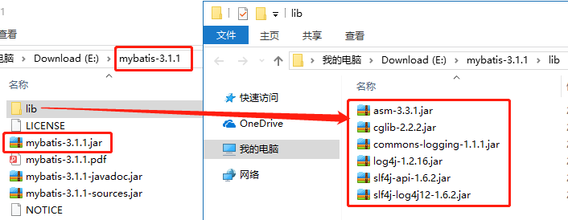
- - -
2. 数据库表
```sql
CREATE TABLE `user` (
  `id` bigint(20) NOT NULL AUTO_INCREMENT,
  `name` varchar(20) DEFAULT NULL,
  PRIMARY KEY (`id`)
) ENGINE=InnoDB AUTO_INCREMENT=11 DEFAULT CHARSET=utf8;
```
- - -
3. 实体类
```java
@Getter
@Setter
@ToString
public class User {
    private Long id;
    private String name;
}
```
- - -
4. 持久层接口 + 映射文件
* 持久层接口
```java
// IXxxMapper 相当于 IXxxDao
public interface IUserMapper {
    void save(User user);

    void delete(Long id);

    void update(User user);

    User get(Long id);

    List<User> listAll();
}
```

* 映射文件(对应持久层接口)  
`http://www.mybatis.org/mybatis-3/zh/getting-started.html`  
约束: 
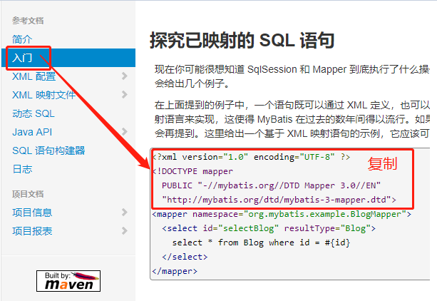

```xml
<!-- IUserMapper.xml -->
<?xml version="1.0" encoding="UTF-8" ?>
<!DOCTYPE mapper
        PUBLIC "-//mybatis.org//DTD Mapper 3.0//EN"
        "http://mybatis.org/dtd/mybatis-3-mapper.dtd">
<mapper namespace="com.hao.mybatis.mapper.IUserMapper">

    <select id="findAll" resultType="com.hao.mybatis.domain.User">
        SELECT * FROM `user`
    </select>

    <select id="findById" resultType="com.hao.mybatis.domain.User" parameterType="Long">
        SELECT * FROM `user` WHERE `id`=#{id}
    </select>

    <insert id="save" parameterType="com.hao.mybatis.domain.User">
        INSERT INTO `user`(`name`) VALUES(#{name})
    </insert>

    <delete id="delete" parameterType="Long">
        DELETE FROM `user` WHERE `id`=#{id}
    </delete>

    <update id="update" parameterType="com.hao.mybatis.domain.User">
        UPDATE `user` SET `name`=#{name} WHERE `id`=#{id}
    </update>

</mapper>
```

5. MyBatis 主配置文件  
* 官方实例命名: mybatis-config.xml
* 其他命名: SqlMapConfig.xml
```xml
<!-- mybatis-config.xml -->
<?xml version="1.0" encoding="utf-8" ?>
<!DOCTYPE configuration
        PUBLIC "-//mybatis.org//DTD Config 3.0//EN"
        "http://mybatis.org/dtd/mybatis-3-config.dtd">
<configuration>

    <environments default="mysql">
        <environment id="mysql">
            <transactionManager type="JDBC"/>
            <dataSource type="POOLED">
                <property name="driver" value="com.mysql.jdbc.Driver"/>
                <property name="url" 
                    value="jdbc:mysql://localhost:3306/mybatis"/>
                <property name="username" value="root"/>
                <property name="password" value="123456"/>
            </dataSource>
        </environment>
    </environments>

    <mappers>
        <mapper resource="com/hao/mybatis/mapper/UserMapper.xml"/>
    </mappers>

</configuration>
```

6. 测试类
```java
public class MyBatisTest {
    @Test
    public void test() throws Exception {
        // 1.读取著配置文件
        InputStream in = 
            Resources.getResourceAsStream("mybatis-config.xml");
        // 2.创建 SqlSessionFactory 对象
        SqlSessionFactory factory = 
            new SqlSessionFactoryBuilder().build(in);
        // 3.获取 SqlSession 对象
        SqlSession session = factory.openSession();
        // 4.获取Mapper(Dao)对象
        IUserMapper mapper = session.getMapper(IUserMapper.class);

        // 5.执行Mapper的方法
        List<User> users = mapper.findAll();
        mapper.save( User对象 );
        session.commit();   // 提交事务
        // ......测试其他方法

        // 6.关闭资源
        session.close();
        in.close();
    }
}
```
> 小结: 使用 mybatis 是非常容易的一件事情，因为只需要编写 Mapper/Dao 接口并且按照mybatis要求编写两个配置文件，就可以实现功能。

* log4j.properties
```properties
# Set root category priority to INFO and its only appender to CONSOLE.
log4j.rootCategory=debug, CONSOLE, LOGFILE

# Set the enterprise logger category to FATAL and its only appender to CONSOLE.
log4j.logger.org.apache.axis.enterprise=FATAL, CONSOLE

# CONSOLE is set to be a ConsoleAppender using a PatternLayout.
log4j.appender.CONSOLE=org.apache.log4j.ConsoleAppender
log4j.appender.CONSOLE.layout=org.apache.log4j.PatternLayout
log4j.appender.CONSOLE.layout.ConversionPattern=%d{ISO8601} %-6r [%15.15t] %-5p %30.30c %x - %m\n

# LOGFILE is set to be a File appender using a PatternLayout.
#log4j.appender.LOGFILE=org.apache.log4j.FileAppender
#log4j.appender.LOGFILE.File=d:\axis.log
#log4j.appender.LOGFILE.Append=true
#log4j.appender.LOGFILE.layout=org.apache.log4j.PatternLayout
#log4j.appender.LOGFILE.layout.ConversionPattern=%d{ISO8601} %-6r [%15.15t] %-5p %30.30c %x - %m\n
```
<br/>

# MyBatis 主配置文件
## 配置内容和顺序
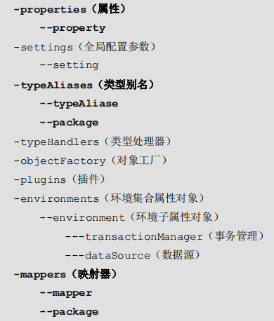
- - -
## `<environments>`  
* 可以配置多个环境，但每个 SqlSessionFactory 实例只能选择一种环境。
* 每个数据库对应一个 SqlSessionFactory 实例:  
```java
SqlSessionFactory factory = 
    new SqlSessionFactoryBuilder().build(reader, environment);

SqlSessionFactory factory = 
    new SqlSessionFactoryBuilder().build(reader, environment, properties);
```
* 环境元素定义了如何配置环境:  
```xml
<environments default="development">
  <environment id="development">
    <transactionManager type="JDBC">
      <property name="..." value="..."/>
    </transactionManager>
    <dataSource type="POOLED">
      <property name="driver" value="${driver}"/>
      <property name="url" value="${url}"/>
      <property name="username" value="${username}"/>
      <property name="password" value="${password}"/>
      <property name="driver.encoding" value="UTF-8"/>
      <property name="defaultTransactionIsolationLevel" 
        value="默认的连接事务隔离级别"/>
    </dataSource>
  </environment>
</environments>
```
* `transactionManager` (事务管理器)  
type (别名表示):  
    * `JDBC`: 直接使用了 JDBC 的提交和回滚设置，它依赖于从数据源得到的连接来管理事务作用域。  
(org.apache.ibatis.transaction.jdbc.JdbcTransactionFactory)
    * `MANAGED`: 它从来不提交或回滚一个连接，而是让容器来管理事务的整个生命周期，默认情况下它会关闭连接。  
(org.apache.ibatis.transaction.managed.ManagedTransactionFactory)

> 如果使用 Spring + MyBatis, 则没有必要配置事务管理器, 因为 Spring 模块会使用自带的管理器来覆盖前面的配置.  

* `dataSource` (数据源)
type (别名表示):  
    * `POOLED`: 使用连接池.   
(org.apache.ibatis.datasource.pooled.PooledDataSourceFactory)
    * `UNPOOLED`: 不使用连接池, 每次被请求时打开和关闭连接。  
(org.apache.ibatis.datasource.unpooled.UnpooledDataSourceFactory)
    * `JNDI`: 为了能在如 EJB 或应用服务器这类容器中使用, 容器可以集中或在外部配置数据源, 然后放置一个 JNDI 上下文的引用.  
    * `自定义`: 要实现这个接口  
      org.apache.ibatis.datasource.DataSourceFactory
- - -
## `<properties>`  
这些属性都是可外部配置且可动态替换的
```xml
<!-- 级别: property < resource的资源 < 代码 -->
<properties resource="db.properties">
    <!--这里propertie的属性最低级, 会被高级同名覆盖-->
    <property name="属性名" value="属性值">
</properites>
```
```xml
<dataSource type="POOLED">
    <property name="driver" value="${db.driver}"/>
    <property name="url" value="${db.url}"/>
    <property name="username" value="${db.username}"/>
    <property name="password" value="${db.password}"/>
</dataSource>
```
- - -
## `<settings>`
改变 MyBatis 的运行时行为, 配置详细:   
`http://www.mybatis.org/mybatis-3/zh/configuration.html#settings`
```xml
<settings>
    <setting name="设置名" value="设置值"/>
</settings>
```
- - -
## `<typeAliases>`
typeAliases(类型别名) 是为 Java 类型设置一个短的名字，它只和 XML 配置有关。  
```xml
<typeAliases>
    <typeAlias type="全限定类名" alias="别名"/>
</typeAliases>
```
* 每一个包中的 Bean，在没有 @Alias 注解的情况下，会使用 Bean 的首字母小写的非限定类名来作为它的别名。(如: ShoppingCart -> shoppingCart)
```xml
<typeAliases>
    <package name="包名"/>
</typeAliases>
```
* @Alias 指定别名
```java
@Alias("ShoppingCart")
public class ShoppingCart{
}
```
* 常见的 Java 类型内建的相应的类型别名，不区分大小写。
`http://www.mybatis.org/mybatis-3/zh/configuration.html#typeAliases`
- - -
## `<mappers>`
告诉MyBatis去哪里找到 定义好的SQL映射语句.
```xml
<mappers>
    <!-- 映射文件 -->
    <mapper resource="com/hao/mybatis/mapper/UserMapper.xml"/>

    <!-- 注解 -->
    <mapper class="com.hao.mybatis.mapper.IUserMapper"/>
</mappers>
```
```xml
<mappers>
    <!-- 包 -->
    <package name="com.hao.mybatis.mapper"/>
</mappers>
```

<br/>

# Mapper 映射文件
## `<mapper>`
```xml
<mapper namespace="Mapper的全限定类名">
    <select id="Mapper的方法名">...</select>
</mapper>
```
>* MyBatis 就是通过 `namespace.id` 找到定义好的SQL.  
>* MyBatis代理的 Mapper实现类 通过  
`Mapper全限定类名.方法名` 得到对应方法的SQL语句.  
- - -

## `<select>`
```xml
<select id="findById" parameterType="Long" resultType="user">
    SELECT * FROM `user` WHERE `id` = #{id}
</select>
```
* `parameterType` : 参数类型.  
(传入这条语句的参数类的完全限定名或别名)

* `resultType` : 结果类型.  
(返回的期望类型的类的完全限定名或别名. 如果返回的是集合, 那应该设置为集合包含的类型, 而不是集合本身)  

* `#{id}` 相当于取 findById(Long id) 传进来的实参, 当 parameterType 是 Java内建类型, #{xxx}的xxx可以任意名字.

* `#{xxx}` 告诉 MyBatis 创建一个预处理语句（PreparedStatement）参数，在 JDBC 中，这样的一个参数在 SQL 中会由一个 ? 来标识。
- - -
## `<insert>`
```xml
<insert id="save" parameterType="User" useGeneratedKeys="true" keyProperty="id">
    INSERT INTO `user`(`name`) VALUES(#{name})
</insert>
```
* `useGeneratedKeys` : 取出数据库内部生成的主键.  
(仅对 insert 和 update 有用)

* `<selectKey>` 获取键值:  
```xml
<insert>
    <selectKey keyProperty="id" resultType="Long">
        SELECT LAST_IN.SERT_ID();
    </selectKey>
</insert>
```

* `keyProperty` : getGeneratedKeys的返回值 或者 通过insert语句的 selectKey 子元素设置它的键值.  
(仅对 insert 和 update 有用)

* `keyColumn` : 通过生成的键值设置表中的列名, 当主键列不是表中的第一列的时候需要设置。使用多个生成的列，可以设置为逗号分隔的属性名称列表。  
(仅对 insert 和 update 有用)

* `#{name}` 相当于 User对象.getName().

* `#{user.name}` 如果传入一个QurtyVo对象, 相当于  
    QueryVo对象.getUser().getName().
- - -
## `<delete>`
```xml
<delete id="delete" parameterType="Long">
    DELETE FROM `user` WHERE `id`=#{id}
</delete>
```
- - -
## `<sql>`
定义可重用的 SQL 代码段，这些 SQL 代码可以被包含在其他语句中。  
```xml
<!-- 定义-->
<sql id="userColumns">
    ${table}.`id`, ${table}.`name` 
</sql>

<!-- 引用 -->
<select id="findAll" resultType="User">
    SELECT
     <include refid="userColumns">
        <property name="table" value="`user`"/>
     </include>
    FROM `user`
</select>
```
- - -
## `<update>`
```xml
<update id="update" parameterType="User">
    UPDATE `user` SET `name`=#{name} WHERE `id`=#{id}
</update>
```
- - -
## `#{}` `${}`
区别:  
* `#{}` : 参数占位符.
* `${}` : SQL拼接.
> 注意: `${value}` 里面的参数 只能叫 value.
- - -
## 列名 不同 实体类属性名
解决:  
* 方式1: SQL查询的列名起 别名, 性能高但麻烦.    
```xml
<select id="findAll" resultType=".User">
    SELECT `u`.`id` as userId, `u`.`name` as userName 
    FROM `user` u
</select>
```

* 方式2: 使用`<resultMap>`, 性能不如方式1.  
```xml
<resultMap id="userMap" type="User">
    <id property="userId" column="id"/>
    <result property="userName" column="name"/>
</resultMap>

<!-- resultMap 不能与 resultType 一起用 -->
<select id="findAll" resultMap="userMap">
    SELECT * FROM `user`
</select>
```
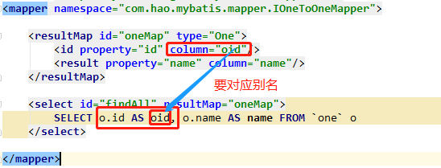

<br/>

# MyBatis 事务
* 提交
```java
session.commit();
```

* 回滚
```java
session.rollback();
```

* 设置自动提交事务 (业务一般不会这样做)
```java
factory.openSession( true );
```

<br/>

# 动态SQL
> 确保 动态SQL标签 前后有空格, 否则会粘在一起导致SQL错误.

## `<if>`  
```xml
SELECT * FROM `user`
WHERE 1=1
 <if test="id != null">
    AND `id` = #{id}
 </if>
```
- - -
## `<choose>` 
`<choose> , <when> , <otherwise> ` 
```xml
SELECT * FROM `user`
WHERE 
 <choose>
    <when test="id != null">
      AND `id` = #{id}
    </when>
    <when test="name != null">
      AND `name` like #{name}
    </when>
    <otherwise>
      1=1
    </otherwise>
  </choose>
```
- - -
## `<where>`  
```xml
<!-- where 元素只会在至少有一个子元素的条件返回 SQL 子句的情况下才去插入“WHERE”子句。而且，若语句的开头为“AND”或“OR”，where 元素也会将它们去除 -->
SELECT * FROM BLOG
 <where>
    <if test="id != null">
        AND id = #{id}
    </if>
    <if test="name != null">
        AND name like #{name}
    </if>
 </where>
```
- - -
## `<trim>`  
```xml
<!-- 如果 where 元素没有按正常套路出牌，我们可以通过自定义 trim 元素来定制 where 元素的功能 -->
SELECT * FROM BLOG
 <trim prefix="WHERE" prefixOverrides="AND|OR">
    <if test="id != null">
        AND id = #{id}
    </if>      
 </trim>
```
- - -
## `<set>`  
```xml
<!-- 可以用于动态包含需要更新的列，而舍去其它的。(注意',') -->
UPDATE `user`
 <set>
    <if test="name != null">`name`=#{name},</if>
    <if test="age != null">`age`=#{age},</if>
 </set> 
WHERE `id`=#{id}
```
- - -
## `<foreach>`  
```xml
<!--
	当迭代 List,Set等可迭代对象 或 数组：
		index：迭代次数；	item：迭代元素。
	
	当迭代字典（或者Map.Entry对象的集合）：
		index：键；	item：值。
-->
SELECT * FROM `user`
WHERE `id` IN
 <foreach collection="list" item="item" index="index" open="(" close=")" separator=",">
    #{item}
 </foreach>
<!-- 如果方法没有@Param, collection的值固定为：集合写list，数组写array，字典写map -->
```

<br/>

# MyBatis 实现DAO的传统开发方式
1. `IUserMapper.xml` 同 入门程序.

2. 编写 IUserMapper 的实现类: `UserMapperImpl`
```java
public class UserMapperImpl implements IUserMapper{
    // com.hao.mybatis.mapper.IUserMapper.
    private final String MAPPER_NAME = IUserMapper.class.getName() + ".";

    public List<User> findAll() {
        SqlSession session = MyBatisUtil.getSqlSession();
        // com.hao.mybatis.mapper.IUserMapper.findAll
        List<User> users = session.selectList(MAPPER_NAME + "findAll");
        session.close();
        return users;
    }

    public User findById(Long id) {
        SqlSession session = MyBatisUtil.getSqlSession();
        // com.hao.mybatis.mapper.IUserMapper.findById
        User user = session.selectOne(MAPPER_NAME + "findById", id);
        session.close();
        return user;
    }

    public void save(User user) {
        SqlSession session = MyBatisUtil.getSqlSession();
        try {
            // com.hao.mybatis.mapper.IUserMapper.save
            session.insert(MAPPER_NAME + "save", user);
            session.commit();
        }catch (Exception e){
            session.rollback();
        }finally {
            session.close();
        }
    }

    public void delete(Long id) {
        SqlSession session = MyBatisUtil.getSqlSession();
        try {
            // com.hao.mybatis.mapper.IUserMapper.delete
            session.delete(MAPPER_NAME + "delete", id);
            session.commit();
        }catch (Exception e){
            session.rollback();
        }finally {
            session.close();
        }
    }

    public void update(User user) {
        SqlSession session = MyBatisUtil.getSqlSession();
        try {
            // com.hao.mybatis.mapper.IUserMapper.update
            session.update(MAPPER_NAME + "update", user);
            session.commit();
        }catch (Exception e){
            session.rollback();
        }finally {
            session.close();
        }
    }
}
```

<br/>

# 多表查询
* 关联  
```xml
<association 
property="Java Bean 关联的对象属性名" 
column="表中表示这个关联关系的列名" 
javaType="关联对象的类型">
    <!-- 关联对象 -->
    <id property="id属性名" column="id列名"/>
    <result property="非id属性名" column="非id列名"/>
</association>
```
* 集合
```xml
<collection 
property="集合对象属性名" 
ofType="集合元素的类型(非集合本身)">
    <!-- 关联对象 -->
    <id property="id属性名" column="id列名"/>
    <result property="非id属性名" column="非id列名"/>
</collection>
```
- - -
## 一对一
1. (关联)嵌套 Select 查询
* `column` : 关联关系的列名.  
* `select`: namespace+方法id 加载指定的方法. 一般, 结合传递的 column值 来查询出关联对象. (注意: 使用的namespace的Mapper接口必须存在)
* `fetchType` : lazy 和 eager.  
指定属性后, 将在映射中忽略全局配置参数 lazyLoadingEnabled.

.png)  

> 问题: N+1  
如果 一对多, One方查询出 N个Many方, 要发出N条SQL, 共发出N+1条SQL.  
性能特别不友好. (可以使用 延迟加载)

2. (关联)嵌套结果映射  
* `resultMap` : 定义好的 resultMap 的id.  
* `columnPrefix` : prefix+原列名 -> 别名,要与 resultMap 配合使用.  
(别名是 resultMap的column值)  

.png)
- - -
## 一对多
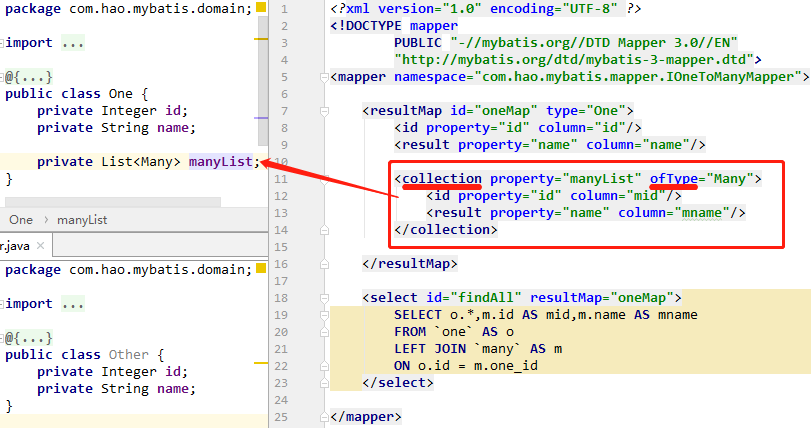
- - -
## 多对多
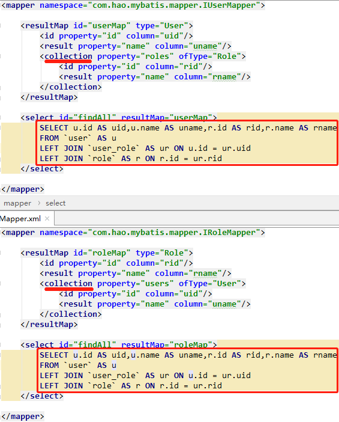

<br/>

# 延迟加载
1. 概述
* 延迟加载: 就是在需要用到数据时才进行加载，不需要用到数据时就不加载数据。延迟加载也称懒加载。  

* 好处: 先单表查询，需要时再从关联表去关联查询，大大提高数据库性能，因为查询单表要比关联查询多张表速度要快。

* 坏处: 因为只有用到数据时，才会进行数据库查询，这样在大批量数据查询时，因为查询工作也要消耗时间，所以造成用户等待时间变长，造成用户体验下降。

* `<association>`,`<collection>` 具备延迟加载功能.
- - -
2. 步骤
* 开启 Mybatis 的延迟加载策略.  
```xml
<!-- MyBatis主配置文件 -->
<settings>
    <!--延迟加载的全局开关。当开启时，所有关联对象都会延迟加载。 特定关联关系中可通过设置 fetchType 属性来覆盖该项的开关状态。-->
    <setting name="lazyLoadingEnabled" value="true"/>

    <!--当开启时，任何方法的调用都会加载该对象的所有属性。 否则，每个属性会按需加载。-->    
    <setting name="aggressiveLazyLoading" value="false"/>

    <!--指定对象的方法触发一次延迟加载。-->
    <setting name="lazyLoadTriggerMethods" 
        value="equals,clone,hashCode,toString"/>
</settings>
```
* `<association>` 或 `<collection>` 使用 嵌套 Select 查询.  
```xml
<!-- 映射文件 -->
<association javaType="Other" property="other"
    column="one_id" select="findOtherByOneId" />

<collection property="manyList" ofType="Many"
    column="one_id" select="findManyByOneId"/>
```

<br/>

# MyBatis 缓存
## 一级缓存
* 一级缓存是 SqlSession 级别的缓存（默认开启），只要 SqlSession 没有 flush 或 close，它就存在。

* 修改，添加，删除，commit()，close() 等操作就会 清空一级缓存。

* sql标签的 `flushCache`属性。flushCache=true，会在sql执行后，同时清空一级缓存和二级缓存。

    增删改：默认`flushCache=true` ；查询：默认`flushCache=false`。

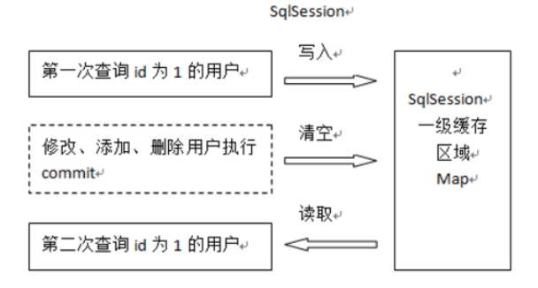

* 一级缓存失效的四种情况：

    * 不同的SqlSession对应不同的一级缓存。
    * 同一个SqlSession但是查询条件不同。
    * 同一个SqlSession两次查询期间执行了任何一次增删改操作。
    * 同一个SqlSession两次查询期间手动清空了缓存

- - -
## 二级缓存
* 二级缓存是 mapper 映射级别的缓存，多个 SqlSession 去操作同一个Mapper 映射的 sql 语句，多个SqlSession 可以共用二级缓存，二级缓存是跨 SqlSession 的。 (SqlSessionFactory层面上的)
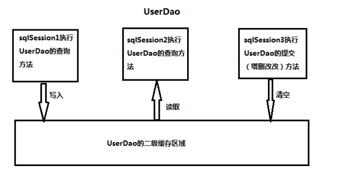

* 使用
1. 开启 二级缓存（二级缓存默认不开启，需要手动配置）
```xml
<!--MyBatis主配置文件-->
<settings>
    <!--全局地开启或关闭配置文件中的所有映射器已经配置的任何缓存-->
    <setting name="cacheEnabled" value="true"/>
</settings>
```

2. 使用二级缓存
```xml
<!-- 映射文件 -->

<!-- 该Mapper使用二级缓存 -->
<cache/>

<!-- userCache: true -> 这个statement使用二级缓存, 
                false -> 不适用二级缓存 -->
<select id="findById" useCache="true"
resultType="User" parameterType="Integer" >
    SELECT * FROM `user` WHERE `id` = #{id}
</select>
```
> session1 调用findById方法, 发送一次SQL, 关闭session1.  
> session2 调用findById方法, 关闭session2. 没有再次发送相同的SQL.  

3. 注意  
* 使用二级缓存时，所缓存的类(Java Bean)一定要实现 `java.io.Serializable` 接口，就可以使用序列化方式来保存对象。
* 二级缓存在SqlSession **关闭或提交** 之后才会生效。

4. 使用第三方缓存

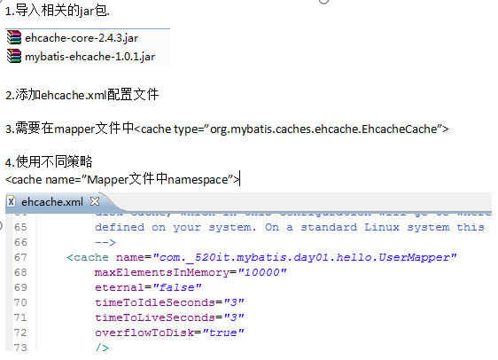


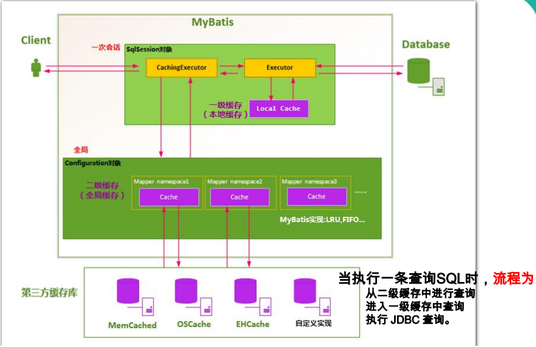

<br/>

# MyBatis 注解
## 注解
* `@Insert` : 保存
* `@Update` : 更新
* `@Delete` : 删除
* `@Select` : 查询
* `@Result` : 封装结果
* `@Results` : 封装结果集
* `@ResultMap` : 引用 @Results 的封装
* `@One` : 一对一 结果集封装
* `@Many` : 一对多 结果集封装
* `@Options` : 选项(使用二级缓存, useGeneratedKeys 等配置)
* `@SelectKey` : 设置键(Insert 里面的 SelectKey)
* `@Param` : 映射方法的多个参数 (如: @Param(“name”), @Param("pwd") -> SQL取值: #{name}, #{pwd})
* `@SelectProvider` : 动态SQL映射
* `@CacheNamespace` : 使用二级缓存
- - -
## CURD
```java
public interface IUserMapper{
    @Results(id = "userMap", value = {
            @Result(property = "id", column = "uid", id = true),
            @Result(property = "name", column = "uname")
    })
    @Select("SELECT * FROM `user`")
    List<User> findAll();


    @Select("SELECT * FROM `user` WHERE `uid`=#{id}")
    @ResultMap("userMap")
    User findById(Integer id);


    @Insert("INSERT INTO `user` (`uname`) VALUES (#{name})"
    @Options(useGeneratedKeys = true, keyProperty = "id")
    void save(User user);


    @Update("Update `user` SET `uname`=#{name} WHERE `uid`=#{id}")
    @SelectKey(keyProperty = "id", resultType = Integer.class,
statement = "SELECT LAST_INSERT_ID()", before = false)
    void update(User user);


    @Delete("DELETE FROM `user` WHERE `uid`=#{id}")
    void delete(Integer id);
}
```
- - -

## 复杂关系映射
* `@Result` 属性:  
    * `id` : 表示主键.  
    * `column` : 类名.  
    * `property` : 映射到属性名.  
    * `javaType` : Java类型.  
    * `jdbcType` : JDBC类型.  
    * `typeHandler` : 类型处理器.  
    * `one` : 映射到复杂类型的单独属性, 取代 `<association>`.  
    * `many` : 映射到复杂类型的集合属性, 取代 `<collection>`. 
- - -
* 嵌套结果映射  

One(单独属性)
```java
@Results(id = "userMap", value = {
        @Result(property = "id", column = "id", id = true),
        @Result(property = "name", column = "name"),
        @Result(property = "account.id", column = "aid"),
        @Result(property = "account.name", column = "aname")
})
@Select("SELECT u.*,a.user_id AS aid,a.name AS aname
    FROM `user` AS u,`account` AS a
    WHERE u.id = a.user_id")
List<User> findAll();
```

Many(集合属性)  
> 使用XML文件定义 resultMap, 使用 @ResultMap 引用.

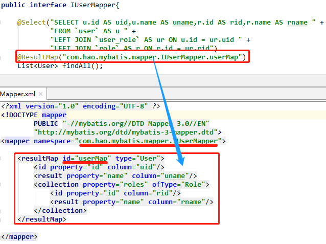
- - -
* 嵌套 Select 查询  

`@One`
```java
// com.hao.mybatis.mapper.IUserMapper
public interface IUserMapper{

    @Results(id = "userMap", value = {
            @Result(property = "id", column = "id", id = true),
            @Result(property = "name", column = "name"),
            @Result(property = "account", column = "id",
                    one = @One(select = "com.hao.mybatis.mapper.IAccountMapper.findById", 
                    fetchType = FetchType.EAGER)
            )
    })
    @Select("SELECT * FROM `user`")
    List<User> findAll();
}

// com.hao.mybatis.mapper.IAccountMapper
public interface IAccountMapper{

    @Select("SELECT * FROM `account` WHERE `id` = #{id}")
    List<Role> findById(Integer id);
}
```

`@Many`
```java
// com.hao.mybatis.mapper.IUserMapper
public interface IUserMapper{

    @Results(id = "userMap", value = {
            @Result(property = "id", column = "id", id = true),
            @Result(property = "name", column = "name"),
            @Result(property = "roles", column = "id",
                    many = @Many(select = "com.hao.mybatis.mapper.IRoleMapper.findAllByUserId", 
                    fetchType = FetchType.LAZY)
            )
    })
    @Select("SELECT * FROM `user`")
    List<User> findAll();
}

// com.hao.mybatis.mapper.IRoleMapper
public interface IRoleMapper{

    @Select("SELECT r.* " +
            "FROM `role` AS r " +
            "LEFT JOIN `user_role` AS ur ON r.id = ur.rid " +
            "WHERE ur.uid = #{userId}")
    List<Role> findAllByUserId(Integer userId);
}
```
- - -

## 二级缓存
1. 开启二级缓存的支持
```xml
<!--MyBatis主配置文件-->
<settings>
    <!-- cacheEnabled 默认值: true -->
    <setting name="cacheEnabled" value="true"/>
</settings>
```

2. 注解配置二级缓存
```java
@CacheNamespace
public interface IUserMapper{

    @Select("SELECT * FROM `user`")
    @Options(useCache = true)
    List<User> findAll();
}
```

<br/>

# MyBatis Generator

## 简介

* 简称MBG,是一个专门为MyBatis框架使用者定制的代码生成器，可以快速的根据表生成对应的 JavaBean类、接口、mapper映射文件。支持基本的增删改查，以及QBC风格的条件查询。但是表连接、存储过程等这些复杂sql的定义需要我们手工编写。
*  [官网](http://www.mybatis.org/generator/)

```xml
<dependency>
    <groupId>org.mybatis.generator</groupId>
    <artifactId>mybatis-generator</artifactId>
    <version>1.3.7</version>
</dependency>
```


## 配置

官网拷贝XML配置文件：`http://www.mybatis.org/generator/configreference/xmlconfig.html`

* **mgb.xml** 或 **generatorConfig.xml**

```xml
<?xml version="1.0" encoding="UTF-8"?>
<!DOCTYPE generatorConfiguration
        PUBLIC "-//mybatis.org//DTD MyBatis Generator Configuration 1.0//EN"
        "http://mybatis.org/dtd/mybatis-generator-config_1_0.dtd">

<generatorConfiguration>
    <!--环境-->
    <context id="mysql" targetRuntime="MyBatis3">

        <!--连接数据库信息-->
        <jdbcConnection driverClass="com.mysql.jdbc.Driver"
                        connectionURL="jdbc:mysql://localhost:3306/mybatis"
                        userId="root"
                        password="123456">
        </jdbcConnection>

        <!--JavaBean的生成策略-->
        <javaModelGenerator targetPackage="com.test.domain" targetProject=".\src\main\java">
            <property name="enableSubPackages" value="true" />
            <property name="trimStrings" value="true" />
        </javaModelGenerator>

        <!--映射文件的生成策略-->
        <sqlMapGenerator targetPackage="com.test.mapper"  targetProject=".\src\main\java">
            <property name="enableSubPackages" value="true" />
        </sqlMapGenerator>

        <!--DAO接口的生成策略-->
        <javaClientGenerator type="XMLMAPPER" targetPackage="com.test.mapper"  targetProject=".\src\main\java">
            <property name="enableSubPackages" value="true" />
        </javaClientGenerator>

        <!--数据表与JavaBean的映射-->
        <table tableName="user" domainObjectName="User">
            <generatedKey column="id" sqlStatement="MySql"/>
        </table>
        <table tableName="country" domainObjectName="Country" >
            <generatedKey column="id" sqlStatement="MySql"/>
        </table>

    </context>
</generatorConfiguration>
```

注意：

* `<context>`属性`targetRuntime`：
    * **MyBatis3**：支持CRUD和QBC查询（默认值）。
    * **MyBatis3Simple**：只支持简单的CRUD。


## 生成

1. Java代码生成

    ```java
    InputStream in = Thread.currentThread().getContextClassLoader().getResourceAsStream("mbg.xml");
    List<String> warnings = new ArrayList<String>();
    boolean overwrite = true;
    ConfigurationParser cp = new ConfigurationParser(warnings);
    Configuration config = cp.parseConfiguration(in);
    DefaultShellCallback callback = new DefaultShellCallback(overwrite);
    MyBatisGenerator generator = new MyBatisGenerator(config, callback, warnings);
    generator.generate(null);
    in.close();
    ```

    

2. Maven插件生成

    **pom.xml**

```xml
<project>
	......
    <build>
        ......
        <plugins>
            ......
            <plugin>
                <groupId>org.mybatis.generator</groupId>
                <artifactId>mybatis-generator-maven-plugin</artifactId>
                <version>1.3.7</version>
                <configuration>
                    <!--配置mbg.xml的位置-->
                    <configurationFile>src/main/resources/mbg.xml</configurationFile>
                    <overwrite>true</overwrite>
                </configuration>
                <!--mbg.xml需要mysql驱动包的依赖(com.mysql.jdbc.Driver)-->
                <dependencies>
                    <dependency>
                        <groupId>mysql</groupId>
                        <artifactId>mysql-connector-java</artifactId>
                        <version>5.1.47</version>
                    </dependency>
                </dependencies>
            </plugin>
            ......
        </plugins>
    </build>
</project>
```

运行方式：

* `mybatis-generator:generate`
* `mvn mybatis-generator:generate`
* Eclipse或IDEA的maven插件运行

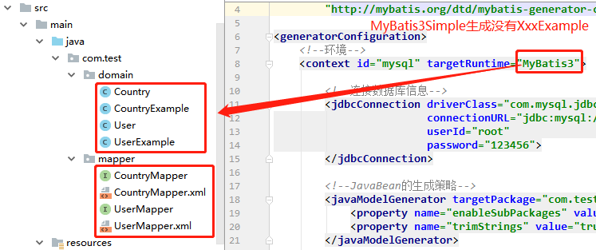


## 测试查询

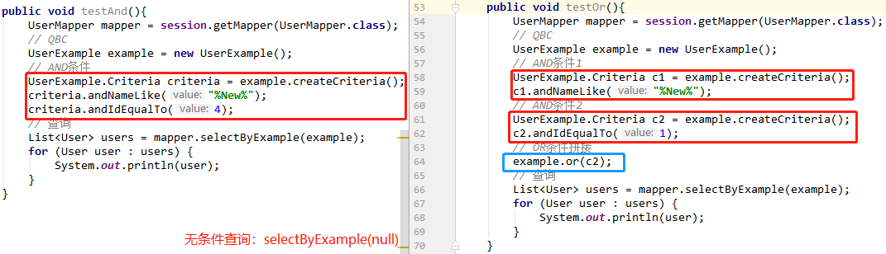

<br/>

