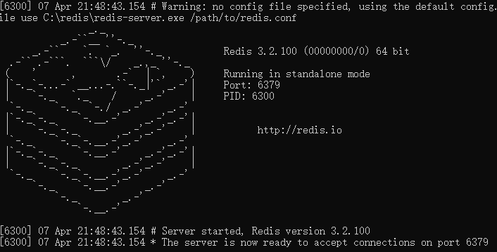
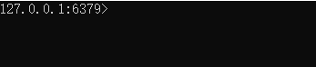

# 环境搭建
## 解压目录(windows x64版)

* redis.windows.conf (配置文件)

* redis-cli.exe (redis的客户端)

* redis-server.exe (redis的服务器端)

    

## 操作

* redis-server.exe : 开启服务, 端口：6379

* redis-cli.exe : 默认连接本地服务 127.0.0.1:6379>



## redis的数据结构

* redis存储数据格式: key(字符串), value(5种结构)  

* value的数据格式:
    * 字符串类型 string  
    * 哈希类型 hash (Map格式)  
    * 列表类型 list (LinkedList格式)  
    * 集合类型 set  
    * 有序集合类型 sort set   


<br/>

# 命令操作
## 字符串类型 string

```shell
# 存储 (设置同个key会覆盖前value)  
set [key] [value]

# 获取 (获取不到返回 nil )  
get [key]

# 删除  
del [key...]
```


## 哈希类型 hash

```shell
# 存储 (filed-value对应Map的key-value)  
hset [key] [field] [value]

# 获取  
hget [key] [field]	#获取指定field对应的值
hgetall [key]	#获取所有field和value

# 删除
hdel [key] [field...]
```


## 列表类型 list

```shell
# 存储  
lpush [key] [value...]	#列表头部添加元素  
rpush [key] [value...]	#列表尾部添加元素
lset [key] [index] [value]	#设置对应索引的元素

# 获取  
lindex [key] [index]	#根据索引获取元素
llen [key]	#列表长度  
lrange [key] [start] [stop]	#获取所有元素

# 删除  
lpop [key]	#弹出第一个元素
rop [key]	#弹出最后一个元素
lrem [key] [count] [value]	#弹出count数量的value
ltrim [key] [start] [stop]	#保存指定区域的元素，其余全部删除
```


## 集合类型 set

```shell
# 存储  
sadd [key] [member...]

# 获取  
scard [key]	#集合长度  
smembers [key]	#获取所有元素

# 删除  
srem [key] [member...]
```


## 有序集合类型 sort set

```shell
# 存储  
zadd [key] [score member]...	#score是排序用的  

# 获取  
zcard [key]	#集合长度
zrange [key] [start] [stop] [WITHSCORES]	#升序获取所有元素[带有分数] 
zrevrange [key] [start] [stop] [WITHSCORES]	#降序获取所有元素[带有分数]

# 删除  
zrem key [member...]
```


## 通用命令

```shell
# 获取所有key(pattern:正则表达式)  
key [pattern]

# 获取key对应value的类型  
type [key]

# 删除key-value  
del [key...]
```
<br/>

# 持久化
redis持久化机制 (redis是内存数据库，服务器或电脑重启，数据丢失)

## RDB

* 在一定时间内，检测key的变化情况，然后持久化数据。(默认方式) (推荐使用)  
* 使用:  
  	* (配置文件) redis.windows.conf : 默认配置
      ```python
      #   after 900 sec (15 min) if at least 1 key changed
      #   after 300 sec (5 min) if at least 10 keys changed
      #   after 60 sec if at least 10000 keys changed

      save 900 1
      save 300 10
      save 60 10000
      ```
   
* 修改配置后启动服务器,才能生效 (直接启动服务器是加载默认配置):  
       `redis-server.exe  redis.windows.conf`  
   
* 持久化文件: dump.rdb    


## AOF (不推荐使用)

* 日志记录的方式,可以检测每一条命令的操作.每一次命令操作后,持久化数据. 
* 使用: 
	* 修改 redis.windows.conf  

    ```python
    #   默认是 appendonly no, 修改为yes表示使用AOF
    appendonly yes

    #   每一次操作, 都持久化一次
    #   每隔1秒, 持久化一次
    #   不持久化

    # appendfsync always
    appendfsync everysec
    # appendfsync no
    ```

* 修改配置后启动服务器,才能生效 (直接启动服务器是加载默认配置):  
    `redis-server.exe  redis.windows.conf`  

* 持久化文件: appendonly.aof 

<br/>

# Java客户端：Jedis
`Jedis是一款java操作redis数据库的工具`
* jar包:   

```
jedis-3.0.1.jar
commons-pool2-2.6.1.jar
```

* 模板  

```java
// 1.获取连接, 空参构造器(默认 host:"localhost",port:6379)
Jedis jedis = new Jedis("localhost",6379);
// 2.操作(方法名跟命令差不多)
jedis.set("name","Tony");
// 3.关闭连接
jedis.close();
```

* 特殊操作   

`字符串类型`  
```java
// 设置过期时间的key-value, 单位:秒
jedis.setex("activeCode", 20, "hello");
```
<br/>

# Jedis连接池: JedisPool
* 使用  
```java
// 0.创建连接池配置对象，配置连接池
JedisPoolConfig config = new JedisPoolConfig();
config.setMaxTotal(50);
config.setMaxIdle(10);

// 1.创建连接池对象, 默认 host:"localhost"   port:6379
JedisPool pool = new JedisPool(config);

// 2.调用方法getResource() 获取连接对象Jedis
Jedis jedis = pool.getResource();

// 3.操作

// 4.连接对象归还到连接池
jedis.close();
```

* JedisPoolUtil  
```properties
# jedis.properties
host=localhost
port=6379
maxTotal=50
maxIdle=10
```

```java
public class JedisPoolUtil {
    // 连接池对象
    private static JedisPool jedisPool;

    static{
        Properties prop = new Properties();
        try {
            // 读取jedis.properties
            prop.load(JedisPoolUtil.class.getClassLoader().getResourceAsStream("jedis.properties"));
            // 创建连接池配置对象
            JedisPoolConfig config = new JedisPoolConfig();
            // 设置最大连接对象数
            config.setMaxTotal( Integer.parseInt(prop.getProperty("maxTotal")) );
            // 设置最大空闲时间
            config.setMaxIdle( Integer.parseInt(prop.getProperty("maxIdle")) );
            // 初始化连接池对象
            jedisPool = new JedisPool( config, prop.getProperty("host"), Integer.parseInt(prop.getProperty("port")) );

        } catch (IOException e) {
            e.printStackTrace();
        }
    }

    /**
     *  获取连接对象
     */
    public static Jedis getJedis(){
        return jedisPool.getResource();
    }
}
```

```java
// 1.连接池获取连接对象
Jedis jedis = JedisPoolUtil.getJedis();

// 2.操作

// 3.连接对象归还到连接池
jedis.close();
```
<br/>

# 应用
* **使用redis缓存一些不经常发生改变的数据**  
* **数据库的数据一旦发生改变，则需要更新缓存**  
    (数据库表发生DML操作，在service对应的增删改方法中，删除redis缓存数据)  