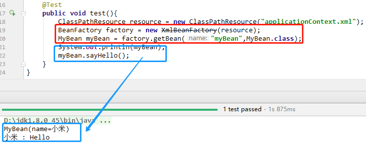
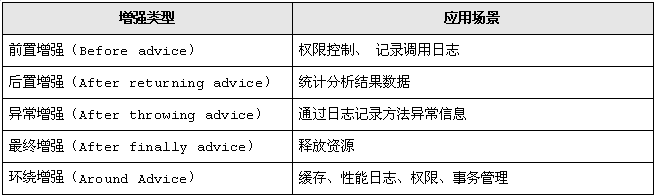

# Spring 概述
## Spring框架简介
* 轻量级：Spring 是非侵入性的 - 基于 Spring 开发的应用中的对象可以不依赖于 Spring 的 API
* 依赖注入(DI --- dependency injection、IOC)
* 面向切面编程(AOP --- aspect oriented programming)
* 容器: Spring 是一个容器, 因为它包含并且管理应用对象的生命周期
* 框架: Spring 实现了使用简单的组件配置组合成一个复杂的应用. 在 Spring 中可以使用 XML 和 Java 注解组合这些对象
* 一站式：在 IOC 和 AOP 的基础上可以整合各种企业应用的开源框架和优秀的第三方类库 （实际上 Spring 自身也提供了展现层的 SpringMVC 和 持久层的 Spring JDBC）


## IOC(控制反转)

IOC(Inversion of Control)：指将对象的创建权，反转给了Spring容器.

其思想是反转资源获取的方向. 应用了 IOC 之后, 容器主动地将资源推送给它所管理的组件, 组件所要做的仅是选择一种合适的方式来接受资源.

* **正控**：若调用者需要使用某个对象，其自身就得负责该对象的创建。
* **反控**：调用者只管负责从Spring容器中获取需要使用的对象，不关心对象的创建过程，也就是把创建对象的控制权反转给了Spring框架。

## DI(依赖注入)

DI(Dependency Injection)：指Spring创建对象的过程中，将对象依赖属性（简单值，集合，对象）通过配置设值给该对象.

IOC 的另一种表述方式——即组件以一些预先定义好的方式(例如: setter 方法)接受来自如容器的资源注入. 相对于 IOC 而言，这种表述更直接.

<br/>

# Spring 入门程序

1. 导入jar包

    - spring-beans-5.1.7.RELEASE.jar
    - spring-core-5.1.7.RELEASE.jar

2. 准备

    ```java
    @Data
    public class MyBean {
        private String name;
    
        public void sayHello(){
            System.out.println(this.name + " : Hello");
        }
    }
    ```

    ```xml
    <!-- reources下的 applicationContext.xml -->
    <?xml version="1.0" encoding="UTF-8"?>
    <beans xmlns="http://www.springframework.org/schema/beans"
           xmlns:xsi="http://www.w3.org/2001/XMLSchema-instance"
           xsi:schemaLocation="
           http://www.springframework.org/schema/beans
           http://www.springframework.org/schema/beans/spring-beans.xsd">
    
        <bean id="myBean" class="com.hao.domain.MyBean">
            <property name="name" value="小米"/>
        </bean>
    
    </beans>
    ```

    

3. 测试

    


4. 分析

* BeanFactory对象.**getBean( )** 三种方法签名：
    * getBean( **bean类型** ) : 要求bean类型唯一.
    * getBean( **bean名字** ) 	
    * getBean( **bean名字, bean类型** ) : 推荐.

<br/>

# Spring 测试


1. 测试依赖jar包：

    * junit-4.12.jar (4.12以上版本)

    * hamcrest-core-1.3.jar

    * spring-aop-5.1.7.RELEASE.jar

    * spring-beans-5.1.7.RELEASE.jar

    * spring-context-5.1.7.RELEASE.jar

    * spring-core-5.1.7.RELEASE.jar

    * spring-test-5.1.7.RELEASE.jar
    
2. 步骤

```java
@RunWith(SpringJUnit4ClassRunner.class)
@ContextConfiguration("classpath:applicationContext.xml")
public class AppTest{
    @Autowired
    private MyBean myBean;

    @Test
    public void test(){
    	myBean.sayHello();
    }
}
```

> 如果把`@ContextConfiguration("classpath:applicationContext.xml")`写成`@ContextConfiguration`：默认去找当前测试类名-context.xml配置文件(如：AppTest-context.xml)

<br/>

# IOC容器

## ApplicationContext

* `BeanFactory`：是Spring中最底层的接口，只提供了最简单的IoC功能,负责配置，创建和管理bean.

  * Spring最基本的接口,表示Spring容器. 生产bean对象的工厂,负责配置,创建和管理bean.

  * 备注：bean是Spring管理的单位，在Spring中一切都是bean。

      

* `ApplicationContext`：在应用中，一般不使用BeanFactory，而推荐使用ApplicationContext。
  
    原因如下（BeanFactory和ApplicationContext的区别）：
    
    * ApplicationContext继承了BeanFactory，拥有了基本的IoC功能。
    * 除此之外，ApplicationContext还提供了以下的功能：
        * 支持国际化；
        
        * 支持消息机制；
        
        * 支持统一的资源加载；
        
        * 支持AOP功能；
        
            
    
* ApplicationContext **常见实现类**：

    * `ClassPathXmlApplicationContext`  ：读取classpath中的资源

	```java
	ApplicationContext ctx = new ClassPathXmlApplicationContext("applicationContext.xml");
	```

	
	
	* `FileSystemXmlApplicationContext`  ：读取指定路径的资源
	
	```java
	ApplicationContext ctx = 
	    new FileSystemXmlApplicationContext("c:/applicationContext.xml");
	```
	
	
	
	* `XmlWebApplicationContext`  ：需要在Web的环境下才可以运行
	```java
	XmlWebApplicationContext ctx = new XmlWebApplicationContext(); //这时没有初始化容器
	ctx.setServletContext( ServletContext对象 ); //指定ServletContext对象
	ctx.setConfigLocation( "applicationContext.xml路径" ); //指定spring配置文件路径
	ctx.refresh();	// 初始化容器
	```


## bean

### 创建时机

* `ApplicationContext`初始化就会创建所有bean。（Web应用）
* `BeanFactory`需要等到获取bean才会创建bean。（桌面应用）


### 实例化方式

* 构造器实例化(无参数构造器)（使用最多）

```java
public class SomeBean {
    public SomeBean(){
    }
}
```

```xml
<bean name="someBean" class="com.hao.domain.SomeBean"/>
```


* 静态工厂方法实例化（解决系统遗留问题）

```java
public class SomeBeanFactory {
    public static SomeBean getSomeBean(){
        return new SomeBean();
    }
}
```

```xml
<bean name="someBean" class="com.hao.factory.SomeBeanFactory" 
      factory-method="getSomeBean"/>
```


* 实例工厂方法实例化（解决系统遗留问题）

```java
public class SomeBeanFactory {
    public SomeBean getSomeBean(){
        return new SomeBean();
    }
}
```

```xml
<bean name="someBeanFactory" class="com.hao.factory.SomeBeanFactory"/>
<bean name="someBean" factory-bean="someBeanFactory" factory-method="getSomeBean"/>
```


* 实现 `FactoryBean`接口 实例化（集合其他框架使用）
    `org.springframework.beans.factory.FactoryBean`

```java
public class SomeBeanFactory implements FactoryBean<SomeBean>{

    public SomeBean getObject() throws Exception {
        return new SomeBean();
    }

    public Class<?> getObjectType() {
        return SomeBean.class;
    }

    // true: 单例     false: 多例(默认实现)
    public boolean isSingleton() {
        return false;   
    }
}
```

```xml
<bean id="someBean" class="com.hao.factory.SomeBeanFactory"/>
```


### 作用域

```java
<bean scope=""/>
```

| scope     | 说明                                                         |
| --------- | ------------------------------------------------------------ |
| singleton | 单例。容器创建完成就会创建bean，并调用 init-method 指定的方法。<br />容器关闭调用 destroy-method 指定的方法。 |
| prototype | 多例。容器创建完成不会创建bean。用到才会创建并调用 init-method 指定的方法。<br />容器关闭并不会调用 destroy-method 指定的方法，需要使用者自己调用destroy方法。 |


## XML配置

### `<import>`

```xml
<import resource="classpath: 其他spring配置xml文件"/>
```

注意：

* 默认情况下，从classpath的根路径寻找。
* 可以使用前缀来定位文件的基础位置，只有实现了Resource接口才能够识别前缀标识符。
    * classpath (推荐)
    * file

- - -

### `<beans>`

* 常用属性 : 
    * **default-lazy-init** : 
    * **default-init-method** : 
    * **default-destroy-method** : 
    * **default-autowire** : 
    * **default-autowire-candidates**

- - -

### `<bean>`

- 常用属性
    - **id**：bean的唯一标识。
    - **name**：别名，可以多个，用 逗号或空格 隔开。
    - **class**：bean的全限定类名 或 factory的全限定类名。
    - **scope**：作用域。
        - singleton：单例，容器仅存在一个bean实例。
        - prototype：多例，每次获取都是一个新的实例。
    - **init-method**：bean的初始化方法
    - **destroy-method**：的bean销毁方法
    - **autowire**：自动装配
        - default：no。
        - no：不要自动注入。
        - byName：按照属性名字注入bean。
        - byType：按照属性类型注入bean。
        - constructor：按照构造器的参数类型注入bean。
    - **abstract**：抽象，作为`<bean>`元素的父元素被继承。
        - true：不需要Spring容器来实例化该类。
        - false：Spring容器来实例化该类。
    - **parent**：继承`父<bean>`。值：`父<bean>`的id，仅仅继承(拷贝)`父<bean>`的配置，并不是Java的继承。


- 常用子元素
    - **property**：属性注入。
        - name
        - value
        - ref：
    - **constructor**：构造器注入。
        - value
        - ref
        - name
        - index
        - type

* * *

### `<context:annotation-config>`

- 开启支持注解的驱动。

* * *

### `<context:component-scan>`

- 常用属性：
    - **base-package**：全限定包名。多个包名可用 逗号 隔开。

* * *

### `<context:property-placeholder>`

- 常用属性：
    - **location**：properties文件的位置。例：`classpath:db.properties`。
    - **file-encoding**：文件编码。
    - **ignore-unresolvable**：是否忽略解析不到的属性。
        设置为true，用于加载多个properties。


## DI(依赖注入)

* DI (Dependency Injection)：Spring创建对象的过程中，将对象依赖属性通过配置进行注入。

* 注入方式：
    * 自动装配
    * 手动装配


#### 自动装配

设置`<bean>`的 **autowire** 属性.

```xml
<bean id="someBean" class="com.hao.domain.SomeBean" autowire="xxx"/>
```


#### 手动装配

* 注入方式：

    * **属性**注入（**Setter**方法）

    ```xml
    <bean id="xxx" class="bean的全限定类名">
        <property name="属性名" value="属性值"/>
    </bean>
    ```

    > * 在配置文件中的值都是string，string可以自动完成类型的转换。
    > * 属性的注入在 init-method 执行之前完成。
    > * 顺序：构造器 -> 属性注入 -> init-method.

    

    * **构造器**注入

    ```xml
    <bean id="xxx" class="bean的全限定类名">
        <constructor-arg name="参数名" value="参数值"/>
    </bean>
    ```

    

    * **SpEL**注入
    ```xml
    <bean id="xxx" class="bean的全限定类名">
        <property name="属性名" value="#{SpEL表达式}"/>
    </bean>
    ```
    
- - -

* 可注入的类型：

    * **简单**类型
    
    ```xml
<property name="属性名" value="简单值"/>
	```
    
    * **引用**类型

	```xml
<bean id="xxx" class="某bean的全限定类名"/>
	<property name="属性名" ref="xxx"/>
    ```
    
    * **集合**类型
    ```xml
    <property name="属性名">
        <!--Set集合-->
        <set>
            <value>值1</value>
            <value>值2</value>
            <value>值3</value>
        </set>
    </property>

    <property name="属性名">
        <!--List集合-->
        <list>
            <value>值1</value>
            <value>值2</value>
            <value>值3</value>
        </list>
    </property>

    <property name="属性名">
        <!--String数组-->
        <array>
            <value>值1</value>
            <value>值2</value>
            <value>值3</value>
        </array>
    </property>

    <property name="属性名">
        <!--Map集合-->
        <map>
            <entry key="键1" value="值1"/>
            <entry key="键2" value="值2"/>
            <entry key="键3" value="值3"/>
        </map>
    </property>

    <property name="属性名">
        <!--Properties集合-->
        <props>
            <prop key="键1">值1</prop>
            <prop key="键2">值2</prop>
            <prop key="键3">值3</prop>
        </props>
    </property>

    <property name="属性名">
        <!--Properties集合，另一种写法-->
        <value>
            p1=v1
            p2=v2
            p3=v3
        </value>
    </property>
    ```


## 注解配置

依赖注入：

* 通过`@Autowired`或`@Resource`可以让Spring自动的把需要的对象容器找出来，并注入给该成员。
* 可以注入Spring内置的重要对象。（如：BeanFactory、ApplicationContext等）

* 使用注解需要引入解析器：`<context:annotation-config />`

    ```xml
    <!-- applicationContext.xml -->
    <context:annotation-config />
    ```

- - -

### `@Autowired`

* Spring定义的标签，所以对象和spring框架关联。

* 可标注位置：构造器，方法，参数，字段，注解

* 可以使用`@Qualifier("bean的id")`标签来规定依赖对象：按照 bean的id+类型 去找。

* 默认情况下使用`@Autowired`必须能找到对象，否则报错。

    * 可用 **required** 来避免：`@Autowired( required=false )`

* 找bean方式：

    1. 首先按照 **依赖对象的类型** 找，找到则使用 Setter方法或字段 直接注入。
    2. 如果找到多个匹配的类型，再按照 **名字** 找，没有匹配则报错。
    3. 如果配合 `@Qualifier("beanId")` ，需要同时匹配类型和名字，否则报错。

* 使用：

    * 字段

    ```java
    @Autowired
    @Qualifier("person")
    private Person person;
    ```

    

    * 方法

    ```java
    // 为一个属性注入多个对象。（独有功能）
    @Autowired
    public void setAB(A a, B b) {
        this.a = a;
        this.b = b;
    }
    ```
    
    
    * 构造器
    
    ```java
    // 如果bean只有一个有参构造器，@Autowired 可以不写，参数能自动注入进来。
    public Car( @Autowired A a ) {
        this.a = a;
    }
    ```
    
    

- - -

### `@Resource`

* JavaEE规范的标签，在J2EE规范容器中也能正常使用。

* 可标注位置：类，接口，枚举，字段，方法

* 找bean方式：

    1. 首先按照 **名字** 找，找到则使用 Setter方法或字段 注入。
    2. 如果名字找不到，再按照 **类型** 找。但匹配多个类型则报错。
    3. 使用 `@Resource( name="beanId" )` 只能按照名字找，找不到也不会按照类型找

* 使用：

    ```java
    @Resource(name = "person")
    private Person person;
    ```

- - -

### `@Component`

bean的注入，相当于  `<bean id="名字" class="全限定类名" />`。

* 默认名字：首字母小写的类名。

* 修改名字：属性 **value="名字"**。

* 使用：

    ```java
    @Component("mybean")
    public class MyBean {
    }
    ```

* 限制：
    * 不能使用到 静态工厂方法 和 实例工厂方法 实例化bean的类，但可以使用到 实现`FactoryBean`接口实例化bean的类。
    * 对于没有源代码的类，只能使用XML配置。
    


* bean组件版型注解：

    * `@Service` : 业务层
    * `@Controller` : 控制层
    * `@Repository` : 数据层
    * `@Component` : 泛指组件

```java
@Repository("userDao")
public class UserDaoImpl implements IUserDao{
}
```

```java
@Service("userService")
public class UserServiceImpl implements IUserService{
    @Resource(name="userDao")
    private IUserDao userDao;
}
```

```java
@Service("userController")
public class UserController{
    @Resource(name="userService")
    private IUserService userService;
}
```

- - -

### `@Scope`

作用域：相当于 `<bean scope="作用域" />`。

```java
@Controller("userAction")
@Scope("prototype")
public class UserAction {
}
```


## 属性占位符

```xml
<!-- ${key} 获取到properties的value -->
<bean>
    <property name="属性名" value="${Properties的key}"/>
</bean>
```

连接池案例：

```properties
# db.properties
db.driver=com.mysql.jdbc.Driver
db.url=jdbc:mysql://localhost:3306/hrm
db.username=root
db.password=123456
db.maxActive=5
```


```xml
<!-- applicationContext.xml -->

<!-- 引入属性配置文件 -->
<context:property-placeholder location="classpath:db.properties"/>

<!-- 配置连接池 (使用 属性占位符) -->
<bean id="dataSource" class="com.alibaba.druid.pool.DruidDataSource" 
      init-method="init" destroy-method="close">
    <property name="driverClassName" value="${db.driver}"/>
    <property name="url" value="${db.url}"/>
    <property name="username" value="${db.username}"/>
    <property name="password" value="${db.password}"/>
    <property name="maxActive" value="${db.maxActive}"/>
</bean>
```


* Spring2.5 引入一个新的 **p命名空间** (其它字母不行)，通过`<bean>`元素属性的方式配置bean。

    

<br/>

# AOP

## 动态代理

* **动态代理类**：程序运行期间由JVM通过反射等机制动态生成，所以不存在代理类的字节码文件。代理对象和真实对象的关系是程序运行才确定的。
* **原理**：创建代理对象，代理对象在 **处理器** 中实现**增强操作**（对真实对象执行的方法的增强）。
* **最小单位**：类。（所有类中的方法都会被处理）
    会拦截所有public方法，如果只想拦截部分方法，需要在invoke(下面讲)方法进行过滤。
- - -

* 案例准备：

```java
public interface IMoneyService {
    // 转账
    void transAccount();
}
```

```java
public class MoneyServiceImpl implements IMoneyService {
    // 转账：A->B
    public void transAccount(){
        System.out.println("A转出1000");
        System.out.println("B转入1000");
    }
}
```

```java
public class TransactionManager {

    public void beginTransaction(){
        System.out.println("开启事务");
    }

    public void commit(){
        System.out.println("提交事务");
    }

    public void rollback(){
        System.out.println("回滚事务");
    }

    public void close(){
        System.out.println("释放资源");
    }
}
```


### JDK动态代理

Java动态代理机制生成的所有动态代理类的父类, 它提供了一组静态方法来为一组接口动态地生成代理类及其对象.

* 创建代理对象：`java.lang.reflect.Proxy` 。
  
    ```java
// 静态方法，返回：代理对象
    public static Object newProxyInstance(ClassLoader loader, Class<?>[] interfaces, InvocationHandler handler) throws IllegalArgumentException
    ```
    
    * 参数：
        * ClassLoader **loader**：类加载器
        * Class<?>[] **interfaces**：真实对象实现的接口
        * InvocationHandler **handler**：代理执行处理器
    
      
  
* 代理执行处理器：实现 `java.lang.reflect.InvocationHandler` 接口。

    ```java
    // 返回：代理方法执行结果
    public Object invoke(Object proxy, Method method, Object[] args) throws Throwable{
        // 对真实方法的增强操作
    }
    ```
    * 参数：
        * Object **proxy**：真实对象
        * Method **method**：真实对象当前调用的方法
        * Object[] **args**：当前调用方法的实参
        
    
* 注意：

    - 代理对象必须实现接口。

    

* 案例实现：

```java
public class TransactionManagerHandler implements InvocationHandler{
    @Setter
    private TransactionManager transactionManager;   // 事务管理器

    @Setter
    private Object target;  // 真实对象
    
    // 创建并返回代理对象
    public Object getProxyObject(){
        return Proxy.newProxyInstance(
                this.getClass().getClassLoader(),
                target.getClass().getInterfaces(),
                this);
    }
    
    // 具体方法的增强处理
    public Object invoke(Object proxy, Method method, Object[] args) throws Throwable {
        Object result = null;
        transactionManager.beginTransaction();   // 开启事务
        try {
            result = method.invoke(target,args);    // 执行具体的业务方法
            transactionManager.commit(); // 提交事务
        }catch (Exception e){
            e.printStackTrace();
            transactionManager.rollback();   // 回滚事务
        }finally {
            transactionManager.close();  // 释放资源
        }
        return result;
    }
}
```

```xml
<!-- 事务管理器 -->
    <bean id="transactionManager" class="com.hao.tx.TransactionManager"/>
    
    <!-- 代理对象处理器 -->
    <bean class="com.hao.tx.TransactionManagerHandler">
        <property name="transactionManager" ref="transactionManager"/>
        <property name="target">
            <!-- 真实对象 -->
            <bean class="com.hao.service.impl.MoneyServiceImpl"/>
        </property>
    </bean>
```

- - -

### CGLib动态代理

​	CGLib (Code Generation Library) 动态代理：原理是对指定的目标类生成一个子类，并覆盖其中方法实现增强，但因为采用的是继承，所以不能对final修饰的类进行代理。

* 创建代理对象：`org.springframework.cglib.proxy.Enhancer`。

    ```java
    // 创建 Enhancer(增强器)对象
    Enhancer enhancer = new Enhancer();
    // 设置要增强的父类(真实对象)
    enhancer.setSuperclass( Class superclass );
    // 做什么增强，回调到 org.springframework.cglib.proxy.InvocationHandler的invoke方法
    enhancer.setCallback( final Callback callback );
    return enhancer.create();   // 创建代理对象
    ```

* 代理执行处理器：实现 `org.springframework.cglib.proxy.InvocationHandler` 接口。

    ```java
    // 返回：代理方法执行结果
    public Object invoke(Object proxy, Method method, Object[] args) throws Throwable{
        // 对真实方法的增强操作
    }
    ```
    * 参数：
        * Object **proxy**：真实对象
        * Method **method**：真实对象当前调用的方法
        * Object[] **args**：当前调用方法的实参
    
* 注意：

    * 类不能是final的，拦截的方法要是非final、非static、非private的。

    

* 案例实现：

```java
public class TransactionManagerCallback implements InvocationHandler{

    @Setter
    private TransactionManager transactionManager;   // 事务管理器

    @Setter
    private Object target;  // 真实对象

    // 创建并返回代理对象
    public Object getProxyObject(){
        Enhancer enhancer = new Enhancer();
        enhancer.setSuperclass(target.getClass());
        enhancer.setCallback(this);
        return enhancer.create();
    }

    // 具体方法的增强处理
    public Object invoke(Object proxy, Method method, Object[] args) throws Throwable {
        Object result = null;
        transactionManager.beginTransaction();   // 开启事务
        try {
            result = method.invoke(target,args);    // 执行具体的业务方法
            transactionManager.commit(); // 提交事务
        }catch (Exception e){
            e.printStackTrace();
            transactionManager.rollback();   // 回滚事务
        }finally {
            transactionManager.close();  // 释放资源
        }
        return result;
    }
}
```

```xml
<!-- 事务管理器 -->
    <bean id="transactionManager" class="com.hao.tx.TransactionManager"/>

    <!-- 代理对象回调器 -->
    <bean class="com.hao.tx.TransactionManagerCallback">
        <property name="transactionManager" ref="transactionManager"/>
        <property name="target">
            <!-- 真实对象 -->
            <bean class="com.hao.service.impl.MoneyServiceImpl"/>
        </property>
    </bean>
```


## AOP概念

学习了动态代理，发现为N个service提供代理需要在XML配置N次。Spring的AOP能够解决这个问题。

* **AOP** (Aspect Oriented Programming) ：面向切面编程。
* **目的**：能够将那些与业务无关，却为业务模块所共同调用的逻辑或责任（例如事务处理、日志管理、权限控制等）封装起来，便于减少系统的重复代码，降低模块间的耦合度，使系统容易扩展、更好的代码复用性，并有利于未来的可拓展性和可维护性。


* Spring的AOP使用动态代理**实现**：
    * 如果一个类实现了接口,那么Spring就使用 JDK的动态代理 完成AOP。
    * 如果一个类没有实现接口,那么Spring就是用 CGLib的动态代理 完成AOP。
* AOP中的**概念**：
    * **切入点（Pointcut）**：在哪些类，哪些方法上切入（**where**）。
    * **增强（Advice）**：方法执行的时机 (**when**：方法前/方法后/方法前后)，做什么 (**what**：增强的功能)。
    * **切面（Aspect）**：**切面=切入点+通知**，通俗点就是：在什么时机，什么地点，做什么增强。
    * **织入（Weaving）**：把切面加入到对象，并创建出代理对象的过程。（该过程由Spring来完成）。


## AspectJ

* AspectJ (语言)：表示在 哪些包下的 那些类的 哪些方法上 做切入。
* **语法**（ ?：表示有无都可以）：

```xml
execution(<修饰符>? <返回类型> <声明类型>? <方法名>(<参数>) <异常>?)
```


## XML实现AOP

* 配置 aop命名空间
    * 需要jar包：
        * spring-aop-5.1.7.RELEASE.jar
        * aspectjweaver-1.9.4.jar


* 配置AOP

```xml
<!-- 事务管理器 -->
<bean id="transactionManager" class="com.hao.tx.TransactionManager"/>

<!--AOP配置-->
<aop:config>
    <!--What：做什么做强-->
    <aop:aspect ref="transactionManager">
        <!--Where：在哪些地方增强-->
        <aop:pointcut id="txPointcut" 
                      expression="execution(* com.hao.service.*Service.*(..))"/>
        <!--When：什么时机增强-->
        <aop:before method="beginTransaction" pointcut-ref="txPointcut"/>
        <aop:after-returning method="commit" pointcut-ref="txPointcut"/>
        <aop:after-throwing method="rollback" pointcut-ref="txPointcut"/>
        <aop:after method="close" pointcut-ref="txPointcut"/>
    </aop:aspect>
</aop:config>
```

测试：

```java
@RunWith(SpringJUnit4ClassRunner.class)
@ContextConfiguration("classpath:applicationContext.xml")
public class AppTest{

    @Resource(name = "moneyService")
    IMoneyService moneyService;

    @Test
    public void test(){
        moneyService.transAccount();
    }
}
```

> **结果**
>
> 开启事务
> A转出1000
> B转入1000
> 提交事务
> 释放资源


## AOP的各种增强




* 注意：
    * 如果使用 环绕增强，就不要出现前面的增强，否则造成重复。
    * 异常增强的接收类型是 `Throwable`，
        XML中`throwing="e"`值 由具体增强类中的 异常增强方法的形参名决定。


## 注解实现AOP

### `@Aspect`

```java
// 相当于 <aop:aspect  ref="transactionManager">
@Component("transactionManager")
@Aspect
public class TransactionManager{...}
```


### `@Pointcut`

```java
/* 相当于 
<aop:pointcut id="txPointcut" expression="execution(* com.hao.service.*Service.*(..))"/>
*/
@Pointcut("execution(* com.hao.service.*Service.*(..))")
public void txPointcut(){ //空方法 }
```


### `@Before`

```java
// 相当于 <aop:before method="beginTransaction" pointcut-ref="txPointcut"/>
@Before("txPointcut()")
public void beginTransaction(){...}
```


### `@AfterReturning`

```java
// 相当于 <aop:after-returning method="commit" pointcut-ref="txPointcut"/>
@AfterReturning("txPointcut()")
public void commit(){...}
```


### `@AfterThrowing`

```java
// 相当于 <aop:after-throwing method="rollback" throwing="e" pointcut-ref="txPointcut"/>
@AfterThrowing(value = "txPointcut()", throwing = "e")
public void rollback(Throwable e){...}
```


### `@After`

```java
// 相当于 <aop:after method="close" pointcut-ref="txPointcut"/>
@After("txPointcut()")
public void close(){...}
```


### `@Around`

```java
// 相当于 <aop:around method="arround" pointcut-ref="txPointcut"/>
@Around("txPointcut()")
public Object arround(ProceedingJoinPoint pjp){...}
// Spring自动注入 ProceedingJoinPoint对象。
// pjp.proceed()；	返回被增强方法执行的结果 
```


### 使用

```xml
<!--扫描包找到 TransactionManager，告诉Spring容器去管理这个bean -->
<context:component-scan base-package="com.hao.tx" />

<!--AOP自动代理：自动为spring容器中那些配置 @AspectJ切面的bean创建代理，织入切面。-->
<aop:aspectj-autoproxy/>
```

```java
@Component("transactionManager")
@Aspect
public class TransactionManager {

    @Pointcut("execution(* com.hao.service.*Service.*(..))")
    public void txPointcut(){}

    @Before("txPointcut()")
    public void beginTransaction(){
        System.out.println("开启事务");
    }

    @AfterReturning("txPointcut()")
    public void commit(){
        System.out.println("提交事务");
    }

    @AfterThrowing(value = "txPointcut()", throwing = "e")
    public void rollback(Throwable e){
        System.out.println(e.getMessage());
        System.out.println("回滚事务");
    }

    @After("txPointcut()")
    public void close(){
        System.out.println("释放资源");
    }

	@Around("txPointcut()")
    public Object arround(ProceedingJoinPoint pjp){
        Object result = null;
        beginTransaction();
        try {
            result = pjp.proceed();
            commit();
        }catch (Throwable e){
            rollback(e);
        }finally {
            close();
        }
        return result;
    }
}
```

* 注意：
    * 如果使用 @Around，就不要用上面的增强时机的注解。
    * 增强时机的注解，如 `@Around("txPointcut()")`，value="txPointcut()"，千万不要漏掉"()"。

<br/>


# Spring支持JDBC

* Spring提供的JDBC模板类：
    * `org.springframework.jdbc.core.JdbcTemplate`
    * `org.springframework.jdbc.core.support.JdbcDaoSupport`

* 准备：
    * jar包：
        * MySQL驱动包
        * spring-jdbc-5.1.7.RELEASE.jar
    * 实体类

    ```java
    @Data
    public class Job {
        private Long id;
        private String name;
    }
    ```

    * DAO接口

    ```java
    public interface IJobDao {
        
        void save(Job job);
        
        void delete(Long id);
        
        void update(Job job);
        
        List<Job> listAll();
        
        Job findById(Long id);
    }
    ```


## JdbcTemplate

`org.springframework.jdbc.core.JdbcTemplate`

```java
public class JobDaoImpl implements IJobDao{

    // Spring提供的 JDBC模板类
    private JdbcTemplate jdbcTemplate;

    public final void setDataSource(DataSource dataSource) {
		if(this.jdbcTemplate == null || dataSource != this.jdbcTemplate.getDataSource()){
			this.jdbcTemplate = new JdbcTemplate(dataSource);
		}
	}

    public void save(Job job) {
//        PreparedStatementCreatorFactory factory = new PreparedStatementCreatorFactory("INSERT INTO `job`(`name`) VALUES (?)", Types.VARCHAR);
//        factory.setReturnGeneratedKeys(true);
//        PreparedStatementCreator psc = factory.newPreparedStatementCreator(new Object[]{job.getName()});
//        KeyHolder keyHolder = new GeneratedKeyHolder();
//        this.jdbcTemplate.update(psc, keyHolder);
//        long id = keyHolder.getKey().longValue();
//        System.out.println(id);
//        job.setId(id);
        this.jdbcTemplate.update("INSERT INTO `job`(`name`) VALUES (?)", job.getName());
    }

    public void delete(Long id) {
        this.jdbcTemplate.update("DELETE FROM `job` WHERE `id`=?", id);
    }

    public void update(Job job) {
        this.jdbcTemplate.update("UPDATE `job` SET `name`=? WHERE `id`=?", job.getId(), job.getName());
    }

    public List<Job> listAll() {
        return this.jdbcTemplate.query("SELECT * FROM `job`", new RowMapper<Job>() {
            @Override
            public Job mapRow(ResultSet rs, int rowNum) throws SQLException {
                Job job = new Job();
                job.setId(rs.getLong("id"));
                job.setName(rs.getString("name"));
                return job;
            }
        });
    }

    public Job findById(Long id) {
        List<Job> jobs = this.jdbcTemplate.query("SELECT * FROM `job` WHERE `id`=?", new RowMapper<Job>() {
            @Override
            public Job mapRow(ResultSet rs, int rowNum) throws SQLException {
                Job job = new Job();
                job.setId(rs.getLong("id"));
                job.setName(rs.getString("name"));
                return job;
            }
        }, id);
        return jobs.size() == 1 ? jobs.get(0) : null;
    }
}
```

```xml
<bean id="jobDao" class="com.hao.dao.impl.JobDaoImpl">
    <property name="dataSource" ref="dataSource"/>
</bean>
```


## JdbcDaoSupport

`org.springframework.jdbc.core.support.JdbcDaoSupport`

```java
public class JobDaoImpl extends JdbcDaoSupport implements IJobDao{

    public void save(Job job) {
		// JdbcTemplate : this.jdbcTemplate.update(...);
        // JdbcDaoSupport : 将 this.jdbcTemplate 改为 super.getJdbcTemplate()。
        super.getJdbcTemplate()
            .update("INSERT INTO `job`(`name`) VALUES (?)", job.getName());
    }
```

```xml
<bean id="jobDao" class="com.hao.dao.impl.JobDaoImpl">
    <property name="dataSource" ref="dataSource"/>
</bean>
```


## 获取自增主键

* 使用update的参数列表：

```java
jdbcTemplate.update(PreparedStatementCreator psc, KeyHolder generatedKeyHolder);
```

* 使用：

```java
/*
创建 PreparedStatementCreator 的工厂类，
构造器：PreparedStatementCreatorFactory(String sql, int... types)
	sql：目标SQL；	
	types：SQL占位符？的类型，有多少个？就对应多少个type。
			java.sql.Types 包含这些类型。
*/
PreparedStatementCreatorFactory factory = 
    new PreparedStatementCreatorFactory("INSERT INTO `job`(`name`) VALUES (?)", Types.VARCHAR);
// 设置返回自增的主键
factory.setReturnGeneratedKeys(true);
// 构建 PreparedStatementCreator对象，并且设置占位符对应的参数
PreparedStatementCreator psc = 
    factory.newPreparedStatementCreator(new Object[]{job.getName()});
// 创建 GeneratedKeyHolder对象，用于保存返回的主键
KeyHolder keyHolder = new GeneratedKeyHolder();
// 执行DML操作
this.jdbcTemplate.update(psc, keyHolder);
// 取得返回的主键
long id = keyHolder.getKey().longValue();
// 设置主键到Job对象
job.setId(id);
```

<br/>

# Spring对事务的支持


## 事务管理的主要接口

* `org.springframework.transaction.PlatformTransactionManager`
    根据TransactionDefinition提供的事务属性配置信息，创建事务。


* `org.springframework.transaction.TransactionDefinition`
    封装事务的隔离级别和超时时间，是否为只读事务和事务的隔离级别和传播规则等事务属性，可通过XML配置具体信息。


* `org.springframework.transaction.TransactionStatus`
    封装了事务的具体运行状态。如，是否是新开启事务，是否已经提交事务，设置当前事务为rollback-only等。


## 声明式事务管理

### XML配置

* jar包：
    * spring-tx-5.1.7.RELEASE.jar
    * 根据事务管理器图，导入：spring-jdbc-5.1.7.RELEASE.jar 或 spring-orm-5.1.7.RELEASE.jar。
* 引入 **tx命名空间**：


* 配置事务：

```xml
<!--配置事务管理器-->
<bean id="transactionManager" 
      class="org.springframework.jdbc.datasource.DataSourceTransactionManager">
    <property name="dataSource" ref="dataSource"/>
</bean>

<!--When：事务管理的时机(环绕增强)-->
<tx:advice id="txAdvice" transaction-manager="transactionManager">
    <tx:attributes>
        <tx:method name="被事务管理的方法名"/>
    </tx:attributes>
</tx:advice>


<aop:config>
    <!--Where：事务管理的地方-->
    <aop:pointcut id="txPointcut" 
                  expression="execution(* com.hao.service.*Service.*(..))"/>
    <aop:advisor advice-ref="txAdvice" pointcut-ref="txPointcut"/>
</aop:config>
```

* 事务方法的属性细节 


```xml
<!-- CRUD通用的环绕增强 -->
<tx:advice id="txAdvice" transaction-manager="transactionManager">
    <tx:attributes>
        <!--查询方法-->
        <tx:method name="get*" read-only="true"/>
        <tx:method name="list*" read-only="true"/>
        <tx:method name="find*" read-only="true"/>
        <tx:method name="query*" read-only="true"/>
        <!--其他方法-->
        <tx:method name="*"/>
    </tx:attributes>
</tx:advice>
```


### 注解配置

**@Transactional**

```xml
<tx:annotation-driven transaction-manager="transactionManager"/>
```


<br/>

# Spring注解驱动开发

## 组件注册

### @Configuration

```java
@Configuration
public class MainConfig {
}
```

```java
public static void main(String[] args) {
    ApplicationContext ctx = 
        new AnnotationConfigApplicationContext(MainConfig.class);
}
```

```java
@RunWith(SpringJUnit4ClassRunner.class)
@ContextConfiguration(classes = MainConfig.class)
public class MainTest {

    @Autowired
    private ApplicationContext ctx;
    
    @Test
    public void test(){
        // 获取已定义的bean (包括扫描进来注册的bean)
        String[] beanNames = ctx.getBeanDefinitionNames();
    }

}
```


### @Bean

* 如果 **@Bean** 配置了属性**name**，id的值就是name，否则默认就是方法名为id。

```java
@Configuration
public class MainConfig {

    @Bean(name = "person")
    public Person person(){
        return new Person("Tony",22);
    }

}
```


### @ComponentScan

* 扫描包的类，将贴上@Component注解的类注册为bean。

```java
@ComponentScan(basePackages = "com.hao.spring")
public class MainConfig {
}
```


* excludeFilters：排除某些类。

```java
@Configuration
@ComponentScan(
        basePackages = "com.hao.spring",
    	// 过滤类型为注解，排除@Service的类
        excludeFilters = @ComponentScan.Filter(
            type = FilterType.ANNOTATION, classes = Service.class
        )
)
public class MainConfig {
}
```


* includeFilters：只包含某些类。( **useDefaultFilters = false** 才会生效。 )

```java
@Configuration
@ComponentScan(
        basePackages = "com.hao.spring",
        useDefaultFilters = false,
    	// 过滤类型为注解，只包含@Controller的类
        includeFilters = @ComponentScan.Filter(
            type = FilterType.ANNOTATION, classes = Controller.class
        )
)
public class MainConfig {
}
```


### @ComponentScans

```java
@Configuration
@ComponentScans({
        @ComponentScan(basePackages = "com.hao.spring.dao"),
        @ComponentScan(basePackages = "com.hao.spring.service"),
        @ComponentScan(basePackages = "com.hao.spring.controller")
})
public class MainConfig {
}
```

如果是JDK8，可以使用重复注解。即在 类MainConfig 贴上多个 @ComponentScan 注解。


### FilterType

| 类型            | 说明                                                         |
| --------------- | ------------------------------------------------------------ |
| ANNOTATION      | 注解（根据@Component, @Repository, @Service, @Controller 不同类型而过滤） |
| ASSIGNABLE_TYPE | 指定类型（例：指定Xxx类，只会注册Xxx类(包括实现类，子类)为bean） |
| ASPECTJ         | AspectJ 表达式                                               |
| REGEX           | 正则表达式                                                   |
| CUSTOM          | 自定义规则                                                   |


*  CUSTOM (自定义规则)：实现`org.springframework.core.type.filter.TypeFilter`接口。

```java
public class MyTypeFilter implements TypeFilter {
    /**
     * 自定义的过滤规则
     * @param metadataReader    读取到的当前正在扫描的类的信息
     * @param metadataReaderFactory     可以获取到 basePackages路径下 其他类的信息
     * @return  true:注册bean		false：跳过
     */
    public boolean match(MetadataReader metadataReader, MetadataReaderFactory metadataReaderFactory) throws IOException {
        metadataReader.();	// 
        metadataReader.();	// 
        metadataReader.();	// 
        return false;
    }
}
```

```java
// 使用
@ComponentScan.Filter(type = FilterType.CUSTOM, classes = MyTypeFilter.class)
```

* MetadataReader
| 方法                  | 说明                     |
| --------------------- | ------------------------ |
| getAnnotationMetadata | 当前扫描的类的注解的信息 |
| getClassMetadata      | 当前扫描的类的信息       |
| getResource           | 当前扫描的类的路径       |


### @Scope

* scopeName : **singleton** (默认)，**prototype**，**request**，**session**。

```java
@Configuration
public class MainConfig {
    @Bean
    @Scope(scopeName = "prototype")
    public Person person(){
        return new Person("Tony",22);
    }
}
```


### @Lazy

* bean默认是单例模式(singleton)，容器创建完成就创建后这些实例。

* 懒加载：容器创建好先不创建这些实例，等到第一次创建对象，再创建这个bean实例。

```java
@Configuration
public class MainConfig {
    @Bean
    @Lazy
    public Person person(){
        return new Person("Tony",22);
    }
}
```


### @Conditional

* 满足条件才将注册bean。
    * 贴在**类**上：满足条件注册类中的所有bean。
    * 贴在**方法**上：满足条件注册这个bean。

```java
@Configuration
public class MainConfig {
    @Bean
    @Conditional(MyCondition.class)
    public Person person(){
        return new Person("Tony",22);
    }
}
```

```java
public class MyCondition implements Condition {
    /**
     *  自定义的匹配规则
     * @param conditionContext  判断条件的上下文
     * @param annotatedTypeMetadata     访问特定类的注解的接口，不需要加载该类
     * @return  true:注册bean     false：跳过
     */
    public boolean matches(ConditionContext conditionContext, AnnotatedTypeMetadata annotatedTypeMetadata) {
        // 匹配规则
        return false;
    }
}
```

* ConditionContext

| 方法              | 说明                              |
| ----------------- | --------------------------------- |
| getBeanFactory    | 获取BeanFactory                   |
| getEnvironment    | 获取环境（例：os.name[系统名字]） |
| getResourceLoader | 获取资源加载器                    |
| getClassLoader    | 获取类加载器                      |


### @Import

* @Import( {组件} )：快速导入组件。容器会自动注册这些组件，id为组件的全限定类名。

```java
@Configuration
@Import( {BookDao.class, BookService.class} )
public class MainConfig {
}
```

* @Import( 自定义类 实现接口: `org.springframework.context.annotation.ImportSelector` )，
    id为组件的全限定类名。

```java
@Configuration
@Import(MyImportSelector.class)
public class MainConfig {
}
```

```java
public class MyImportSelector implements ImportSelector {
    /**
     * 导入组件
     * @param annotationMetadata    当前标注@Import的类的所有注解的信息
     * @return  组件的全限定类名数组
     */
    public String[] selectImports(AnnotationMetadata annotationMetadata) {
        // 不能返回null，会发生 NullPointerException
        return new String[]{
                BookDao.class.getName(),
                BookService.class.getName()
        };
    }
}
```

* @Import( 自定义类 实现接口: `org.springframework.context.annotation.ImportBeanDefinitionRegistrar` )，
    id为组件的全限定类名。

```java
@Configuration
@Import(MyImportBeanDefinitionRegistrar.class)
public class MainConfig {
}
```

```java
public class MyImportBeanDefinitionRegistrar implements ImportBeanDefinitionRegistrar {
    /**
     * 注册bean
     * @param annotationMetadata    当前标注@Import的类的所有注解的信息
     * @param beanDefinitionRegistry    BeanDefinition注册类(bean的注册器)
     */
    public void registerBeanDefinitions(AnnotationMetadata annotationMetadata, BeanDefinitionRegistry beanDefinitionRegistry) {
        // registerBeanDefinition( bean的id, bean的class(BeanDefinition的实现类) )
        beanDefinitionRegistry.registerBeanDefinition(
            "bookService", new RootBeanDefinition(BookService.class)
        );
    }
}
/*
BeanDefinition的实现类：
	方式一：
	new RootBeanDefinition( Class<?> beanClass )
	方式二：
	BeanDefinitionBuilder.rootBeanDefinition().getBeanDefinition( Class<?> beanClass )
*/
```


### FactoryBean

* 配置 factoryBean (实现`org.springframework.beans.factory.FactoryBean`) ，在容器注册的是factoryBean 调用 getObject( ) 返回的bean。

```java
public class ColorFactoryBean implements FactoryBean<Color> {
    /**
     * 获取bean
     */
    public Color getObject() throws Exception {
        return new Color();
    }

    /**
     * 获取bean的类型
     */
    public Class<?> getObjectType() {
        return Color.class;
    }

    /**
     * bean是否单例[ true:单例;   false:多例 ]
     */
    public boolean isSingleton() {
        return true;
    }
}
```

```java
@Configuration
public class MainConfig {
    @Bean
    public ColorFactoryBean color(){
        return new ColorFactoryBean();
    }
}
```

1. getBean( **id** ) 获取到 bean。
2. getBean( **&id** ) 获取到 factoryBean。

```java
applicationContext.getBean("color");	// class com.hao.spring.bean.Color

applicationContext.getBean("&color");	// class com.hao.spring.factory.ColorFactoryBean
```


## 生命周期

### @Bean

* @Bean( initMethod="初始化方法", destroyMethod="销毁方法" )

```java
@Configuration
public class MainConfig {
    // 要求Car的 init方法 和 destroy方法 必须是无参的。(异常任意抛)
    @Bean(initMethod = "init", destroyMethod = "destroy")
    public Car car(){
        return new Car();
    }
}
```


### InitializingBean

* `org.springframework.beans.factory.InitializingBean` : 实现该接口的 afterPropertiesSet 方法, 定义初始化逻辑。

```java
public class Car implements InitializingBean {

    public void afterPropertiesSet() throws Exception {
        // 初始化操作
    }
}
```


### DisposableBean

* `org.springframework.beans.factory.InitializingBean` : 实现该接口的 destroy 方法, 定义销毁逻辑。

```java
public class Car implements DisposableBean {

    public void destroy() throws Exception {
        // 销毁操作
    }
}
```


### @PostConstruct

```java
public class Car {

    @PostConstruct
    public void init(){
        // 初始化操作
    }
}
```


### @PreDestroy

```java
public class Car {

    @PreDestroy
    public void destroy(){
        // 销毁操作
    }
}
```


### BeanPostProcessor

* `org.springframework.beans.factory.config.BeanPostProcessor` : 实现该接口。
    * 重写 postProcessBeforeInitialization 方法 : 所有bean初始化方法之前的操作(构造器之后)。
    * 重写 postProcessAfterInitialization 方法 : 所有bena初始化方法之后的操作。

```java
@Component
public class MyBeanPostProcessor implements BeanPostProcessor {
	/**
	 * 如果返回null，底层接收还是原来的bean。
	 * 如果返回bean的包装类，底层接收到的bean就是返回的包装类
	 */	
    @Override
    public Object postProcessBeforeInitialization(Object bean, String beanName) throws BeansException {
        // 所有bean初始化前的操作
        return bean;
    }

	/**
	 * 如果返回null，底层接收还是原来的bean。
	 * 如果返回bean的包装类，底层接收到的bean就是返回的包装类
	 */
    @Override
    public Object postProcessAfterInitialization(Object bean, String beanName) throws BeansException {
        // 所有bean初始化后的操作。
        return bean;
    }
}
```


> 总结：方法的先后顺序
>
> **构造器**
> BeanPostProcessor.**postProcessBeforeInitialization**
> **@PostConstruct**
> InitializingBean.**afterPropertiesSet**
> @Bean( **initMethod**="" )
> BeanPostProcessor.**postProcessAfterInitialization**
> ......
> **@PreDestroy**
> DisposableBean.**destroy**
> @Bean( **destroyMethod**="" )


## 属性赋值

### @Value

* @Value( 字符串 )
    * 基本数值
    * SpEL : #{ }
    * ${ } : 取出配置文件[properties]的值(在运行环境变量的值)

```java
public class Color {
    @Value("RED")
    private String name;
}
```


### @PropertySource

* @PropertySource 可以加载多个properties文件。

```java
@PropertySource(value = {"classpath:color.properties"})
@Configuration
public class MainConfig {
    @Bean
    public Color color(){
        return new Color();
    }
}
```

```java
public class Color {
    @Value("${color.name}")
    private String name;
}
```

* ApplicationContext对象.getEnvironment().getProperty( key ) : 获取到properties文件的value。

```java
@Test
    public void test(){
        Environment environment = applicationContext.getEnvironment();
        environment.getProperty("color.name");  //BLUE
    }
```


### @PropertySources

* @PropertySources 配置多个@PropertySource，也可以加载多个properties文件。

```java
@PropertySources(
	@PropertySource("classpath:color.properties"),
    @PropertySource("classpath:car.properties")
)
@Configuration
public class MainConfig {
}
```


## 自动装配

### @Autowired

```java
@Autowired
@Qualifier("color")
private Color color;
```

```java
// @Autowired 标注在 @Bean方法 或 参数，可以省略不写。默认自动从容器注入bean。
@Bean
public Color color( @Autowired Red red){
    return new Color(red);
}
```


### @Resource

```java
@Resource(name="color")
private Color color;
```


### @Primary

* 被 @Primary 标注的bean会优先注入。但是若指定bean名，还是按照bean名去注入。

```java
@Bean
@Primary
public Color color1(){
    return new Color("color1");
}
```


### @Inject

* 功能和 @Autowired 一样。(需要导入依赖)

```java
@Inject
@Qualifier("color")
private Color color;
```


### XxxAware

* 自定义组件想要使用Spring容器底层的一些组件(ApplicationContext, BeanFactory)：
    自定义组件实现 XxxAware接口。容器在创建自定义组件对象时，会调用接口中的方法注入相关组件。

`org.springframework.beans.factory.Aware`的子接口 `XxxAware` .


* bean实现 XxxAware 接口，Spring容器有对应的 BeanPostProcessor实现类，在初始化bean前执行 XxxAware接口的方法。

* `org.springframework.context.ApplicationContextAware`

    ```java
    public interface ApplicationContextAware extends Aware {
        void setApplicationContext(ApplicationContext context) throws BeansException;
    }
    ```

    ```java
    public class Car implements ApplicationContextAware {
        
        private ApplicationContext applicationContext;
    
        // bean初始化前，容器将 applicationContext 注入bean
        public void setApplicationContext(ApplicationContext applicationContext) throws BeansException {
            this.applicationContext = applicationContext;
        }
    }
    ```


### @Profile

* 指定组件在哪个环境才能被注册到容器中。不指定，任何环境都能注册这个组件。

* @Profile( "default" ) : 默认运行环境为 default。@Profile("default")可以不写。

    ```java
    // 不写@Profile，默认就是@Profile("default")，无论什么运行环境，都会被注册为bean。
    @Profile("default")
    @Bean
    public Car car(){
        return new Car();
    }
    ```

* @Profile( 指定环境 ) : 被标注组件只有符合指定的环境才会被注册为bean。

    ```java
    @Profile("test")
    @Bean
    public Color color(){
        return new Color();
    }
    ```

* @Profile( 指定环境 ) 标注在**配置类**上。

    ```java
    // 如果环境不是test，这个类的任何组件(不管组件的@Profile)都不能被容器注册。
    @Profile("test")
    @Configuration
    public class MainConfig {
        ......
    }
    ```

    

* 指定运行环境：

    * 虚拟机参数指定。

        ```shell
        -Dspring.profiles.active=test
        ```

    * 容器初始化指定。

        ```java
        // 如果类型是ApplicationContext不能进行下面的操作
        AnnotationConfigApplicationContext ctx = new AnnotationConfigApplicationContext();
        ctx.getEnvironment().setActiveProfiles("test","dev");	// 可以设置多个环境
        ctx.register(MainConfig.class);
        ctx.refresh();
        ```


## AOP

* 业务类

    ```java
    public class Calculator {
        // 业务方法
        public Integer div(Integer a, Integer b){
            System.out.println("Calculator.div");
            return a / b;
        }
    }
    ```

    

* 切面类

### @Aspect

```java
@Aspect
public class LogAspect {
}
```


### @Pointcut

* 引用：方法的全限定名。如：xxx包.pointcut()。同类可以直接：pointcut()。

```java
@Pointcut("execution( * com.hao.spring.bean.Calculator.*(..) )")
public void pointcut(){}
```


### @Before

* `JoinPoint`参数 必须是参数列表的第一位。

```java
@Before("pointcut()")
public void logBefore(JoinPoint joinPoint){
    // joinPoint.getSignature()   获取方法签名
    String methodName = joinPoint.getSignature().getName(); // 获取方法名
    Object[] args = joinPoint.getArgs();    // 获取方法的参数
    System.out.println( "执行方法: " + methodName + Arrays.toString(args) );
}
```


### @After

```java
@After("pointcut()")
public void logAfter(){
    System.out.println( "执行结束" );
}
```


### @AfterReturning

```java
@AfterReturning(value = "pointcut()", returning = "result")
public void logAfterReturning(JoinPoint joinPoint, Object result){
    System.out.println( "执行正常, 返回结果: " + result );
}
```


### @AfterThrowing

```java
@AfterThrowing(value = "pointcut()", throwing = "exception")
public void logAfterThrowing(JoinPoint joinPoint, Throwable exception){
    System.out.println( "执行出现异常: " + exception );
}
```


### @Around

```java
@Around("pointcut()")
public Object log(ProceedingJoinPoint joinPoint){
    Object result = null;
    // Before
    try {
        result = joinPoint.proceed( joinPoint.getArgs() );
        // AfterReturning
    }catch (Throwable e){
        // AfterThrowing
    }finally {
        // After
    }
    return result;
}
```


* 配置类

### @EnableAspectJAutoProxy

* 相当于 `<aop:aspectj-autoproxy/>` .

```java
@Configuration
@EnableAspectJAutoProxy
public class MainConfig {
    
    @Bean
    public LogAspect logAspect(){
        return new LogAspect();
    }
    
    @Bean
    public Calculator calculator(){
        return new Calculator();
    }
    
}
```


## 事务

### DataSource

```java
// 数据源
@Bean
public DataSource dataSource(){
    DruidDataSource dataSource = new DruidDataSource();
    dataSource.setDriverClassName("com.mysql.jdbc.Driver");
    dataSource.setUrl("jdbc:mysql://localhost:3306/ssm");
    dataSource.setUsername("root");
    dataSource.setPassword("123456");
    return dataSource;
}
```


### PlatformTransactionManager

```java
// 事务管理器
@Bean
public PlatformTransactionManager transactionManager(){
    return new DataSourceTransactionManager( dataSource() );
}
```


### @EnableTransactionManagement

```java
// 相当于 <tx:annotation-driven/>
@EnableTransactionManagement
@Configuration
public class TxConfig {
	...
}
```


### @Transactional

```java
public void UserService{
    // 业务方法加上事务
    @Transactional
    public void insertUser(){
        userDao.insert();
    }
}
```


## 扩展

### BeanFactoryPostProcessor

* `org.springframework.beans.factory.config.BeanFactoryPostProcessor` 接口 : BeanFactory的后置处理器。在BeanFactory标准初始化之后调用，来定制和修改BeanFactory的内容。
* 所有的**bean定义信息已经保存加载到BeanFactory**，但是bean的实例还未创建。
* 在 **bean创建对象之前**，调用BeanFactoryPostProcessor实现类的方法，执行操作。

```java
@Component
public class MyBeanFactoryPostProcessor implements BeanFactoryPostProcessor {
    
    @Override
    public void postProcessBeanFactory(ConfigurableListableBeanFactory beanFactory) throws BeansException {
        // 定制与修改 beanFactory
    }
}
```


 ### BeanDefinitionRegistryPostProcessor

* BeanDefinitionRegistryPostProcessor是 BeanFactoryPostProcessor 的子接口。
* 在所有**bean定义信息将要被加载到BeanFactory**，同样bean实例还未创建。
* **优先于BeanFactoryPostProcessor执行**。利用BeanDefinitionRegistryPostProcessor给容器中再额外添加一些组件。

```java
@Component
public class MyBeanDefinitionRegistryPostProcessor implements BeanDefinitionRegistryPostProcessor {
    
    @Override
    public void postProcessBeanDefinitionRegistry(BeanDefinitionRegistry registry) throws BeansException {
        // registry：bean的注册中心
        // 可以注册bean的信息，如：registry.registerBeanDefinition( beanId, beanClass );
    }

    @Override
    public void postProcessBeanFactory(ConfigurableListableBeanFactory beanFactory) throws BeansException {
        // 定制与修改 beanFactory
    }
    
}
```

> **执行顺序**：
>
> 所有 BeanDefinitionRegistryPostProcessor.**postProcessBeanDefinitionRegistry**
>
> 所有 BeanDefinitionRegistryPostProcessor.**postProcessBeanFactory**
>
> 所有 BeanFactoryPostProcessor.**postProcessBeanFactory**


### ApplicationListener

* `org.springframework.context.ApplicationListener` : 监听容器中发布的事件。

    * `ApplicationListener<E extends ApplicationEvent>` : 监听 ApplicationEvent 及其下面的子事件。

    ```java
    /*
     * 写一个监听器（ApplicationListener实现类）来监听某个事件（ApplicationEvent及其子事件）。
     * 只要容器中有相关事件的发布，我们就能监听到这个事件。
     */
    @Component
    public class MyApplicationListener implements ApplicationListener<ApplicationEvent> {
    
        @Override
        public void onApplicationEvent(ApplicationEvent event) {
            System.out.println("发布的事件: " + event);
        }
    }
    ```

    ```java
    // 发布事件：publishEvent(ApplicationEvent event)
    applicationContext.publishEvent(new ApplicationEvent( Object obj ) {});
    ```

    

* `org.springframework.context.ApplicationEvent` : 事件对象。

    * **ContextRefreshedEvent**：容器刷新完成（所有bean都完全创建）会发布这个事件。
    * **ContextClosedEvent**：关闭容器会发布这个事件。


### @EventListener

```java
@Service
public class UserService {

    @EventListener(classes = {ApplicationEvent.class})
    public void listener(ApplicationEvent event){
        // 收到 ApplicationEvent事件及子事件
    }
}
```


### SmartInitializingSingleton

* 在所有单实例bean初始化完成后，获取所有创建好的单实例bean，判断是否实现 `org.springframework.beans.factory.SmartInitializingSingleton` 接口，
    是：就调用bean的 **afterSingletonsInstantiated** 方法。

```java
public interface SmartInitializingSingleton {

	void afterSingletonsInstantiated();

}
```


## Spring容器 创建流程

