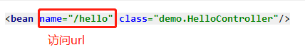
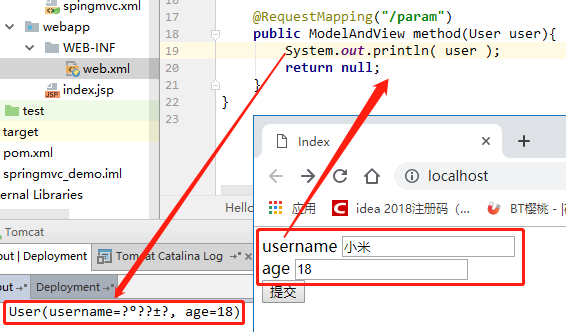

# SringMVC 概述
* Spring MVC是基于MVC模式的一个框架, 它解决WEB开发中常见的问题(参数接收、文件上传、表单验证、国际化、等等), 而且使用简单, 与spring无缝集成.

* Spring MVC是Spring提供的一个强大而灵活的web框架. 借助于注解, Spring MVC提供了几乎是POJO的开发模式, 使得控制器的开发和测试更加简单. 这些控制器一般不直接处理请求, 而是将其委托给Spring上下文中的其他bean, 通过Spring的依赖注入功能, 这些bean被注入到控制器中.

* Spring MVC主要由 DispatcherServlet、处理器映射[找控制器]、适配器[调用控制器的方法]、控制器[业务]、视图解析器、视图组成.

# SpringMVC 入门程序
访问: localhost/hello, 后台打印 Hello World, 跳转到 hello.jsp.
- - -
1. 导入相关jar包  
* spring-beans-4.1.2.RELEASE.jar
* spring-context-4.1.2.RELEASE.jar
* spring-core-4.1.2.RELEASE.jar
* spring-expression-4.1.2.RELEASE.jar
* spring-web-4.1.2.RELEASE.jar
* spring-webmvc-4.1.2.RELEASE.jar  
- - -
2. web.xml 配置分发器
```xml
<servlet>
    <servlet-name>springMVC</servlet-name>
    <servlet-class>  
        org.springframework.web.servlet.DispatcherServlet  
    </servlet-class>
</servlet>

<servlet-mapping>
    <servlet-name>springMVC</servlet-name>
    <url-pattern>/</url-pattern>
</servlet-mapping>
```
启动服务器, 访问 localhost/hello, 报错  

> 需要一个配置文件: /WEB-INF/springMVC-servelt.xml  
(这个文件就是spring框架的applicationContext.xml, 改名为springMVC-servlet.xml. 这个名字其实是`{servlet-name}-servlet.xml`)
- - -
3. 编写 `HelloController`类, 实现 `org.springframework.web.servlet.mvc.Controller` 接口, 重写 handleRequest 方法.
```java
public class HelloController implements Controller{
    @Override
    public ModelAndView handleRequest(HttpServletRequest request, HttpServletResponse response) throws Exception {
        System.out.println("Hello World");
        ModelAndView mv = new ModelAndView();
        mv.setViewName("/hello.jsp");
        return mv;
    }
}
```
- - -
4. 配置这个 Controller 到 application-mvc.xml.  


- - -
5. 访问: localhost/hello


> * 访问: localhost/hello.abcde 也能访问到handleRequest()这个方法.  
> * 原因: springMVC是 匹配名字 而不是匹配路径, 但匹配不一定是精确匹配.    
> * 默认:   
    如果找到 hello.abcde 就精确匹配, 直接进入这个方法.  
    如果找不到就处理成 hello.* 按hello去找方法.

- - -
6. 配置细节  
* 启动服务器时,springMVC不会去加载{servlet-name}-servlet.xml, 而是要等到第一次访问才会去加载, 这样第一次访问的体验不好, 所以我们会这样配置.


* DispatcherServlet 默认找 {servlet-name}-servlet.xml, 我们一般会把配置文件放到 resources目录, 让框架找到这个文件.


```xml
<servlet>
    <servlet-name>springMVC</servlet-name>
    <servlet-class>
        org.springframework.web.servlet.DispatcherServlet
    </servlet-class>
    <init-param>
        <param-name>contextConfigLocation</param-name>
        <param-value>classpath:spingmvc.xml</param-value>
    </init-param>
    <load-on-startup>1</load-on-startup>
</servlet>
```
<br/>

# URL映射方式
## BeanNameURL
BeanNameURL方式 来配置前台请求映射哪个处理类. (很少用)

- - -
## 注解
基于注解的方式来配置URL映射. (推荐)
  

* 这时的类不受限制  
    但如果没有配置 视图解析器, 就要满足下列任一条件, 否则访问报错.
    * 返回类型: `ModelAndView`, 可以空参.
    * 参数列表: 至少有`HttpServletResponse response`,返回类型不限制.
* 原因:  
    * 如果参数中没有response对象且返回值又没有返回ModelAndView对象,这时候springMVC是不知道处理的视图是哪个的?  
    * 当请求`/hello`地址,去到方法后,没有ModelAndView对象,不知道如何去哪里找视图,会自动给你默认的视图`hello`, 相当于循环访问`/hello`, 报500错误.
    * 配置视图解析器, 就得到 `前缀 + hello + 后缀` 这个视图.

## 全注解
全注解方式: 不需要在配置文件配置`<bean class="XxxController">`.
1. 导入AOP的包  
* spring-aop-4.1.2.RELEASE.jar

2. 配置文件: 开启注解扫描 和 驱动支持
```xml
<!-- MVC注解驱动支持 -->
<mvc:annotation-driven/>
<!-- 开启注解支持 -->
<context:component-scan base-package="demo"/>
```
>* 在 SpringMVC 的各个组件中, `处理器映射器`,`处理器适配器`,`视图解析器`称为 SpringMVC 的三大组件.  
>* 使用 `<mvc:annotation-driven>` 自动加载 RequestMappingHandlerMapping(处理映射器) 和
RequestMappingHandlerAdapter(处理适配器).  
>* 在配置文件中使用`<mvc:annotation-driven>`替代注解处理器和适配器的配置.  

3. Controller类: 贴注解  


<br/>

# 静态资源的处理
  

1. 原因:
* Tomcat中有很多内置的servlet.  
比如说数据的回显,由Tomcat里面的servlet 将我们封装的java对象放在我们的jsp页面进行回显呢.  
* 同理,我们需要访问一个静态资源, Tomcat也有对应的servlet为我们处理,恰好该servlet的映射路径也为/ .  
* Tomcat中的 web.xml 是先加载的,项目的 web.xml 是后加载的. 如果配置了相同的路径，后面的会覆盖前面的.
	也就是说, springMVC中的 DispatcherServlet 的映射路径覆盖了Tomcat默认对静态资源的处理的路径. 
	如果配置为/,Tomcat对静态资源处理的Servlet就失效.
- - -
2. 解决: 
* 需要Spring添加支持静态资源处理的配置.
```xml
<!-- 支持对静态资源的处理 -->
<!-- default-servlet-name 默认为 default -->
<mvc:default-servlet-handler default-servlet-name="服务器的servlet-name"/>
```
> 注意: 根据springMVC默认对URL的匹配处理, 当静态资源xxx.后缀名, xxx如果跟 @RequestMapping("/xxx") 重复, 就会当作URL名处理, 进入这个方法, 而不是去加载这个静态资源.
- - -
* 在 springmvc 的配置文件中可以配置, 静态资源不过滤:  
```xml
<!-- 
    location : 路径,
    mapping : 文件,
    ** : 该目录下的文件以及子目录的文件
-->
<mvc:resources location="/css/" mapping="/css/**"/>
<mvc:resources location="/img/" mapping="/img/**"/>
<mvc:resources location="/js/" mapping="/js/**"/>
```
<br/>

# 传参方式
1. 使用serlvet原生api
> localhost/param1?username=Hao
```java
@RequestMapping("/param1")
public ModelAndView method1(HttpServletRequest request, HttpServletResponse response){
    String username = request.getParameter("username");
    return null;
}
```
- - -
2. 方法形参
> localhost/param1?username=Hao

* 前台传入的参数名和方法定义的形参名字一致(基于同名匹配规则)
```java
@RequestMapping("/param2")
public ModelAndView method1(String username){
    System.out.println(username);
    return null;
}
```
* 前台名称和后台形参名字不一致,需要用@RequestParam("前台参数名")来注入
```java
@RequestMapping("/param2")
public ModelAndView method1( @RequestParam("username") String name ){
    System.out.println(name);
    return null;
}
```
- - -
3. 使用模型传参 (前台参数名字需要和模型中的属性名一致)
> localhost/param1?username=Hao&age=18
```java
@Getter
@Setter
@ToString
public class User {
    private String username;
    private int age;
}
```
```java
@RequestMapping("/param3")
public ModelAndView method1(User user){
    System.out.println(user);
    return null;
}
```
- - -
* 传参: 模型+形参  


- - -
4. 地址栏传参
> localhost/delete/5
```java
@RequestMapping("/delete/{delId}")
public ModelAndView method1( @PathVariable("delId") Long id ){
    System.out.println(id);
    return null;
}
```
- - -
**总结：参数绑定**

* 基本类型: 基本类型,基本包装类,String 

* 集合类型: 数组,List,Map  

* POJO类型: 实体类,关联类  
```java
public class User{
    private Sting name;
    private Address address;
    private Integer[] arr;
    private List<Address> list;
    private Map<String,Address> map;
}
```

类型 | 参数名 | 例子  
:-: | :-: | :-
实体类属性 | 属性名 | name  
关联类属性 | 实体类属性名.关联类属性名 | address.city  
数组/List(基本类型) | 集合名[索引] | arr[0]
数组/List(POJO类型) | 集合名[索引].POJO属性名 | list[0].city
Map | Map属性名 | map['default'].city

<br/>

# RESTful风格 URL
* `REST`: Representational State Transfer  
* 四种基本操作 (HTTP的方法):  
    * `GET` : 获取资源  
    * `POST` : 新建资源  
    * `PUT` : 更新资源  
    * `DELETE` : 删除资源

URL | HTTP方法 | 说明
:-: | :-: | :-:
/user | GET| 遍历所有User
/user/{id} | GET | 获取对应id的User
/user | POST | 保存User
/user | PUT | 更新用户
/user/{delId} | DELETE | 删除对应delId的用户

* 优点: 结构清晰、符合标准、易于理解、扩展方便，所以正得到越来越多网站的采用.  
- - -
例子
```java
@Controller
@RequestMapping("/user")
public class UserController {

    @RequestMapping(
        path = "", 
        method = RequestMethod.GET
    )
    public void findAll(){
        // 遍历所有User
    }

    @RequestMapping(
        path = "/{id}", 
        method = RequestMethod.GET
    )
    public void findById( @PathVariable("id") Integer id ){
        // 获取对应id的User
    }

    @RequestMapping(
        path = "", 
        method = RequestMethod.POST
    )
    public void save(User user){
        // 保存User
    }
    
    @RequestMapping(
        path = "", 
        method = RequestMethod.PUT
    )
    public void update( User user ){
        // 更新用户
    }

    @RequestMapping(
        path = "/{delId}", 
        method = RequestMethod.DELETE
    )
    public void delete( @PathVariable("delId") Integer id ){
        // 删除对应delId的用户
    }
}
```

```html
<!-- 表单或ajax, 完成 URL访问 和 数据的传递 -->
```
- - -
问题:  
* 表单只支持 GET 和 POST 的方式.  
* ajax 通过 POST方式 传递的数据, 后台接收为null.

解决:  
* 方式1: 配置Filter: `HiddenHttpMethodFilter`
```xml
<!-- web.xml -->
<filter>
    <filter-name>HiddenHttpMethodFilter</filter-name>
    <filter-class>org.springframework.web.filter.HiddenHttpMethodFilter</filter-class>
</filter>
<filter-mapping>
    <filter-name>HiddenHttpMethodFilter</filter-name>
    <url-pattern>/*</url-pattern>
</filter-mapping>
```
```html
<!-- 表单方式 -->
<form method="post">
    <input type="hidden" name="_method" value="HTTP方式"/>
    <!-- value: GET/POST/PUT/DELETE -->
</form>

<!-- ajax方式 -->
$.ajax({
    url:"/user/10",
    type:"post",
    data:{ _method:"DELETE" }
});
```
- - -
* 方式2: 配置Filter: `HttpPutFormContentFilter`  
    只针对 PUT方式 有效 (该类已过时).

解决: ajax 通过 POST方式 传递的数据, 后台能够完全接收.
```xml
<!-- web.xml -->
<filter>
    <filter-name>HttpPutFormContentFilter</filter-name>
    <filter-class>org.springframework.web.filter.HttpPutFormContentFilter</filter-class>
</filter>
<filter-mapping>
    <filter-name>HttpPutFormContentFilter</filter-name>
    <url-pattern>/*</url-pattern>
</filter-mapping>
```

<br/>

# 类型转换器
* 自定义类型转换器  
实现
org.springframework.core.convert.converter.Converter  
```java
// S:接收类型   T:目标类型
public interface Converter<S, T> {
    T convert(S s);
}
```
* 自定义 字符串日期转换器
```java
/*
    默认 Date类型 接收字符串类型为 yyyy/MM/dd,
    现在URL: /hello?date=2019-05-10
*/
@RequestMapping("/hello")
public String hello(Date date) throws ParseException {
    System.out.println(date);
    return "hello";
}
```
```java
// 解析 字符串yyyy-MM-dd 为 Date类型
public class DateConverter implements Converter<String,Date>{
    @Override
    public Date convert(String s) {
        Date date = null;
        try {
            date = 
            new SimpleDateFormat("yyyy-MM-dd").parse(s );
        } catch (ParseException e) {
            e.printStackTrace();
        }
        return date;
    }
}
```
```xml
<!-- SpringMVC 配置文件 -->
<mvc:annotation-driven 
conversion-service="converterService"/>

<bean id="converterService" class="org.springframework.context.support.ConversionServiceFactoryBean">
    <property name="converters">
        <array>
            <bean class="com.hao.springmvc.converter.DateConverter"/>
        </array>
    </property>
</bean>
```
<br/>

# 中文乱码问题
* Get 方式  

    * `Tomcat 8`  
    Tomcat8 默认进行了url编码,get请求不乱码,Tomcat7会乱码.  

    * `Tomcat 7`

  
解决  
  
- - -
* Post 方式

   
解决: 配置Filter `CharacterEncodingFilter`,并配置参数encoding为UTF-8. (该方式只对 POST请求 有效)
```xml
<filter>
    <filter-name>CharacterEncodingFilter</filter-name>
    <filter-class>
        org.springframework.web.filter.CharacterEncodingFilter
    </filter-class>
    <init-param>
        <param-name>encoding</param-name>
        <param-value>UTF-8</param-value>
    </init-param>
</filter>

<filter-mapping>
    <filter-name>CharacterEncodingFilter</filter-name>
    <url-pattern>/*</url-pattern>
</filter-mapping>
```

结果
  

<br/>

# 拦截器
1. 编写: 拦截器类`XxxInterceptor`
* 实现接口 `org.springframework.web.servlet.HandlerInterceptor`
* 编写逻辑
```java
public class MyInterceptor implements HandlerInterceptor {
    // 请求Controller方法前->调用, 返回 true:放行, false:拦截(等于return,不再放行)
    @Override
    public boolean preHandle(HttpServletRequest request, HttpServletResponse response, Object o) throws Exception {
        return false;
    }

    // Controller方法执行之后,视图结合之前->调用
    @Override
    public void postHandle(HttpServletRequest request, HttpServletResponse response, Object o, ModelAndView modelAndView) throws Exception {

    }

    // 视图结合之后->调用
    @Override
    public void afterCompletion(HttpServletRequest request, HttpServletResponse response, Object o, Exception e) throws Exception {

    }
}
```
2. 配置拦截器
```xml
<mvc:interceptors>
    <mvc:interceptor>
        <!-- 
            拦截的url
            path="/*", 拦截 localhost/*
            path="/**", 拦截 localhost/*/*
        -->
        <mvc:mapping path="/*"/>
        <!-- 
            排除的url
            path="/hello", 排除 localhost/hello
            path="/test/hello", 排除 localhost/test/hello
        -->
        <mvc:exclude-mapping path="/hello"/>
        <!-- 拦截器类 -->
        <bean class="demo.MyInterceptor"/>
    </mvc:interceptor>
</mvc:interceptors>
```
- - -


<br/>

# 传值方式
1. 通过serlvet`原生api方式`回显数据
```java
@RequestMapping("/value1")
public void handleRequest(HttpServletRequest request, HttpServletResponse response) throws Exception {
    request.setAttribute("test", "小米");
    request.getRequestDispatcher("/hello.jsp").forward(request,response);
}
```
- - -
2. 使用`ModelAndView`对象回显内容
```java
@RequestMapping("/value2")
public ModelAndView handleRequest() throws Exception {
    ModelAndView mv = new ModelAndView();
    // 设置数据
    // key:"test", value:"小米"
    mv.addObject("test", "小米");
    // key:"string"(value类型的全小写), value:"华为"
    mv.addObject("华为");
    // 添加一个Map<String,Object>类型: 多个key-value
    mv.addAllObjects(map);

    // 设置跳转视图
    mv.setViewName("/hello.jsp");
    return mv;
}
```
- - -
3. 直接返回`模型`对象
```java
/*
不配置 @ModelAttribute
    key:"user"(返回对象的类名全小写), value: 返回的对象
配置 @ModelAttribute("xxx")
    key:"xxx", value: 返回的对象
*/
@RequestMapping("/value3")
@ModelAttribute("user")
public User handleRequest() throws Exception {
    User user = new User();
    user.setUsername("小米");
    user.setAge(10);

    return user;
}
```
* 但是这样, springMVC不知道去哪找视图, 会自动给你默认的视图: /value3. 所以一直重复访问: localhost/value3, 报错.
> 配置视图解析器, 会根据视图解析器的 前缀(prefix) 和 后缀(suffix), 得到URL: `prefix + value3 + suffix`, 跳转到这个视图.
* 配置视图解析器  
跳转到: /WEB-INF/value3.jsp
```xml
<bean class="org.springframework.web.servlet.view.InternalResourceViewResolver">
    <property name="prefix" value="/WEB-INF/"/>
    <property name="suffix" value=".jsp"/>
</bean>
```
- - -
4. 通过`Model`对象放入需要回显的内容
```java
@RequestMapping("/value4")
public String handleRequest(Model model) throws Exception {
    model.addAttribute("username", "小米");
    return "view";
}
```
> 配置视图解析器,跳转视图: prefix + view + suffix  

如果不需要加上前缀和后缀, 跳转到指定视图:
* `return "forward:xxx.jsp"`  (请求转发)
* `return "redirect:xxx.jsp"` (重定向)

<br/>

# 文件上传
1. 导入文件上传的相关jar包.  
* com.springsource.org.apache.commons.fileupload-1.2.0.jar
* com.springsource.org.apache.commons.io-1.4.0.jar

2. 在配置文件springmvc.xml中 配置文件上传解析器
```xml
<!-- id 必须是 multipartResolver -->
<bean id="multipartResolver" class="org.springframework.web.multipart.commons.CommonsMultipartResolver">
    <property name="maxUploadSize" value="#{10*1024*1024}"/>
</bean>
```

3. 编写方法
```java
    @RequestMapping("/upload")
    public ModelAndView upload(MultipartFile file){
        // MultipartFile file: 变量名必须和 <input name="file" type="file"/>的name值一致.
        // file.getName() 获取<input name="xxx">的name: xxx
        // file.getOriginalFilename() 获取文件原来的名字
        InputStream is = null;
        FileOutputStream os = null;
        try {

            is = file.getInputStream();
            os = new FileOutputStream( new File("e:/",file.getOriginalFilename()) );
            IOUtils.copy(is, os);

        }catch (Exception e){
            e.printStackTrace();
        }finally {
            try {
                if(is != null){
                    is.close();
                }
            }catch (Exception e){
                e.printStackTrace();
            }finally {
                try {
                    if(os != null){
                        os.close();
                    }
                }catch (Exception e){
                    e.printStackTrace();
                }
            }
        }
        return null;
    }
```

<br/>

# 文件下载
springMVC没有做太多的封装,还是使用serlvet下载文件.
> localhost/download?fileName=test.jar  
```java
@RequestMapping("/download")
public void download(HttpServletResponse response, String fileName){
    response.setHeader("Content-Disposition", "attachment;filename="+fileName);
    FileInputStream is = null;
    try {

        is = new FileInputStream(new File("e:/",fileName));
        ServletOutputStream os = response.getOutputStream();
        IOUtils.copy(is, os);

    }catch (Exception e){
        e.printStackTrace();
    }finally {
        try {
            if( is != null ){
                is.close();
            }
        }catch (Exception e){
            e.printStackTrace();
        }
    }
}
```

<br/>

# 常用注解
## @RequestMapping
* 作用: 用于建立请求 URL 和处理请求方法之间的对应关系. 

* 位置:  
    * 类: URL的第一级访问路径.  
    * 方法: URL的第二级访问路径.  

* 属性:  
    * value: 用于指定请求的URL. 跟属性path一样的作用.  
    * method: 用于指定请求的方式.  
    * params: 用于指定限制请求参数的条件. 它支持简单的表达式. 要求请求参数的 key 和 value 必须和配置的一模一样.    
    * headers: 用于指定限制请求消息头的条件.  

```java
@Controller("helloController")
@RequestMapping("/demo")
public class HelloController {

    @RequestMapping(
            value = "/hello",
            method = RequestMethod.GET,
            params = {"name","age!=90"}
            // URL参数必须有name和age, 且age不能等于90
    )
    public void hello(){
        // TODO
    }
}
```
- - -
## @RequestParam
* 作用: 把请求中指定名称的参数给控制器中的形参赋值. 

* 位置: 方法的形参.

* 属性:  
    * value: 请求参数中的名称.  
    * required: 请求参数中是否必须提供此参数.   
    默认值: true. 表示必须提供,如果不提供将报错. 
```java
@RequestMapping("/hello")
public void hello(@RequestParam("name") String username, @RequestParam(value = "age",required = false) Integer age){
      // TODO  
}
```
- - -
## @PathVariable
* 作用: 用于绑定 URL 中的占位符.  
url 支持占位符是 spring3.0 之后加入的, 是 springmvc 支持 REST风格 URL 的一个重要标志.  

* 位置: 方法的形参.  

* 属性: 
    * value: 用于指定 URL 中占位符名称.  
    * required: 是否必须提供占位符. 
```java
@RequestMapping("/delete/{id}")
public void delete(@PathVariable("id") Integer id){
    System.out.println(id);
}
```
- - -
## @ModelAttribute
* 作用:   
    * 贴在方法上, 执行请求方法前, 先执行所有被贴方法.   
    * 贴在形参上, 从被贴方法的 `返回的POJO对象` 或 `形参注入的Map` 中获取对应key的value赋值给形参.
* 位置:  
    * 方法.  
    * 方法的形参.  
* 属性:  
    * name: 获取数据的 key, 获取不到返回 空字符串''.  
    key 可以是 POJO 的属性名称, 也可以是 Map 的 key.    
```java
/*
先执行方法 loadUser()：

    如果 @ModelAttribute 没有设置属性, 再执行方法 hello(User user)时, 按照形参的类型(如User) 将被贴方法返回的值注入到形参.

    如果 @ModelAttribute 设置属性, 再执行方法 hello()时, 按照 @ModelAttribute("u") 找到 key=u 对应的被贴方法返回的值注入到形参.
*/

@ModelAttribute("u")
public User loadUser(){
    User user = new User();
    user.setUsername("Hao");
    user.setAge(18);
    return user;
}

@RequestMapping("/hello")
public String hello( @ModelAttribute("u") User user){
    System.out.println(user);
    return "hello";
}
```
```java
/*
先执行方法 load(), 注意: Map必须时形参注入进来,
再执行hello(), 按照key=word, 从Map中获取对应的value 注入到形参.
*/

@ModelAttribute()
public void load(Map<String,String> map){
    map.put("word", "Hello");
}

@RequestMapping("/hello")
public String hello( @ModelAttribute("word") String word){
    System.out.println(word);
    return "hello";
}
```
- - -
## @CookieValue
* 作用: 获取指定名称 cookie 的value.  
* 位置: 方法的形参.
* 属性:  
    * name: cookie的name.  
    * required: 默认true, 必须存在指定名称的cookie, 否则报错.    
    如果 required=false ,取不到该cookie, 返回的value为空.  
```java
@RequestMapping("/hello")
public String hello(@CookieValue("name") String value){
    System.out.println(value);
    return "hello";
}
```
- - -
## @SessionAttribute
* 作用: 获取 session 指定名称的 attribute.  
* 位置: 方法的形参.
* 属性:  
    * name: session的name.  
    * required: 默认true, session必须存在指定名称的attribute, 否则报错.    
    如果 required=false ,取不到值返回 null.
```java
@RequestMapping("/hello")
public String hello( @SessionAttribute("username") String name){
    System.out.println(name);
    return "hello";
}
```
- - -
## @SessionAttributes
* 作用: 将 模型 中的数据存储一份到session中.    
* 位置: 类.
* 属性:  
    * names: 指定模型中哪些 name-attribute 存储到session中.  
    * types: 根据指定参数的类型,将模型中对应类型的参数存储到session中.

```java
@Controller("helloController")
@SessionAttributes({"username"})
public class HelloController {

    @RequestMapping("/hello")
    public String hello(Model model){
        model.addAttribute("username", "Mi"); // 注意中文乱码
        return "hello";
    }
}
```
- - -
## @ResponseBody
* 作用: 在返回方法加上 `@ResponseBody` (表示: 请求不再交给springMVC处理,会结合JSON包,将对象解析成JSON字符串)

* 位置:  
    * 类
    * 方法
```java
@RequestMapping("/json")
@ResponseBody
public User test(){

    User user = new User();
    user.setUsername("小米");
    user.setAge(18);

    return user;
}
```
> 访问: localhost/json  

> 结果: {"username":"小米","age":18}  
- - -
### jackson  
springMVC默认使用 `jackson` 对java对象和json进行转换.
* 引入jackson的jar包  
    * jackson-databind-2.9.8.jar
    * jackson-core-2.9.8.jar
    * jackson-annotations-2.9.8.jar
- - -
### fastjson
* 导入fastjson的jar包
* 配置文件springmvc.xml中配置用fastjson解析.
```xml
<mvc:annotation-driven>

    <mvc:message-converters register-defaults="true">
        <bean class="com.alibaba.fastjson.support.spring.FastJsonHttpMessageConverter">
            <property name="defaultCharset" value="UTF-8"/>
        </bean>
    </mvc:message-converters>

</mvc:annotation-driven>
```

<br/>

# 区别Struts2

## 源码解析


>* `HanderMapping` 请求映射处理器:(说明书)  
    作用: 根据不同的请求选择最合适的处理器(自己编写的控制器),请求映射处理器可以配置多个,谁最先匹配就执行谁.

>* `Handler` 处理器  
   作用: 它就是开发中要编写的具体业务控制器.  
   由 `DispatcherServlet` 把请求转发到`Handler`. 由`Handler`对具体的用户请求进行处理.   

>* `HandlerAdapter` 处理器适配器:(工具)  
   作用: 支持多种类型的处理器,如何来执行"处理器(控制器)".

>* `ViewResolver` 视图解析器  
   作用: 负责将处理结果生成`View`视图.  
   `ViewResolver`首先根据逻辑视图名解析成物理视图名(即具体的页面地址), 再生成`View`视图对象，最后对`View`进行渲染将处理结果通过页面展示给用户.   

>* `View` 视图:(最常用的视图就是 `jsp`)    
   作用: 一般情况下需要通过页面标签或页面模版技术将模型数据通过页面展示给用户，需要由程序员根据业务需求开发具体的页面.    


<br/>

## 区别: springMVC 与 Struts2
1. 实现机制  
* Struts2是基于过滤器实现的.  
* Springmvc基于servlet实现.
- - -
2. 运行速度: Servlet比Filter快.

* Struts2是 多例, 基于类设计.  
每一次请求，都会创建一个Action对象. 请求来了以后，struts2创建多少个对象：ActionContext，valuestack，UAction，ActionSuport，ModelDriven.

* Springmvc是 单例, 基于方法设计.  
    同一个Controller的请求, 只会创建一个Controller.
- - -
3. 参数封装来分析  
* Struts基于属性进行封装, Action有参数属性.
* springMVC基于方法封装, 参数是写在Controller的方法.

<br/>

# 纯注解版

## Servlet 3.0 新特性

* Servlet 3.0 必须 **Tomcat7及以上**。
* @WebServlet
* @WebFilter
* @WebInitParam
* @WebListener
* @MultipartConfig


### ServletContainerInitializer

* Servlet容器在启动应用的时候，会扫描当前应用每一个jar包里面 
    **/META-INF/services/javax.servlet.ServletContainerInitializer** 
    (文件内容写ServletContainerInitializer实现类的全类名)
    文件指定的 **ServletContainerInitializer实现类** ，启动并运行这个实现类的 **onStartup** 方法。


- - -

* ServletContext **注册三大组件**

    * 必须是在Web应用启动来添加组件。

    ```java
    public class MyServletContainerInitializer implements ServletContainerInitializer {
    
        @Override
        public void onStartup(Set<Class<?>> c, ServletContext servletContext) throws ServletException {
    		// 下面的操作
        }
    }
    ```

    

    * 注册 **Servlet**

        * ```java
            // 添加 <servlet>
            addServlet( String servletName, String className )
            addServlet( String servletName, Servlet servlet )
            addServlet( String servletName, Class <? extends Servlet> servletClass )
            ```

        * ```java
            // 配置 <servlet-mapping>
            addMapping( String... urlPatterns )
            ```

        ```java
        // 添加<servlet>
        ServletRegistration.Dynamic helloServlet = 
            servletContext.addServlet("helloServlet", HelloServlet.class);
        // 配置<servlet-mapping>
        helloServlet.addMapping("/hello");
        ```

        

    * 注册 **Filter**

        * ```java
            // 添加 <filter>
            addFilter( String filterName, String className )
            addFilter( String filterName, Filter filter )
            addFilter( String filterName, Class <? extends Filter> filterClass )
            ```

        * ```java
            // 配置 <filter-mapping>
            addMappingForServletNames( EnumSet<DispatcherType> dispatcherTypes, 
                                      boolean isMatchAfter, String... servletNames )
                
            addMappingForUrlPatterns( EnumSet<DispatcherType> dispatcherTypes, 
                                     boolean isMatchAfter,String... urlPatterns )
            ```

        ```java
        // 添加 <filter>
        FilterRegistration.Dynamic helloFilter = 
            servletContext.addFilter("helloFilter", HelloFilter.class);
        // 配置 <filter-mapping>
        helloFilter.addMappingForUrlPatterns( EnumSet.of(DispatcherType.REQUEST), true, "/*");
        ```

        

    * 注册 **Listener**

        * ```java
            // 添加 <listener>
            addListener(String className)
            addListener(T t) // <T extends EventListener>
            addListener(Class <? extends EventListener> listenerClass)
            ```

        ```java
        // 添加 <listener>
        addListener( HelloListener.class );
        // 注意：因为是ServletContainerInitializer的实现类，是在容器创建时添加Listener，所以Listener必须时 ServletContextListener 的实现类。
        ```

        

### @HandlesTypes

* 给 **ServletContainerInitializer实现类** 传递：感兴趣类。
* 传递的是接口, ServletContainerInitializer实现类的onStartup方法可以拿到 感兴趣类的子类(子接口, 实现类).

```java
@HandlesTypes({IHelloService.class})
public class MyServletContainerInitializer implements ServletContainerInitializer {
    /**
     * @param c     感兴趣类的所有子类型, 但不包含感兴趣类本身
     *              (感兴趣类就是: @HandlesTypes传递过来的类数组)
     *
     * @param ctx   当前Web应用的ServletContext
     */
    @Override
    public void onStartup(Set<Class<?>> c, ServletContext ctx) throws ServletException {
        // 通过 c 拿到感性类的子类来创建对象......
    }
}
```


### 异步请求

* 异步请求：请求执行完非异步代码，归还线程到线程池。再获取新的线程执行异步代码。

```java
// 开启异步的支持
@WebServlet(value = "/hello", asyncSupported = true)
public class HelloServlet extends HttpServlet {

    @Override
    protected void service(HttpServletRequest request, HttpServletResponse response) throws ServletException, IOException {
        // 开始异步
        AsyncContext asyncContext = request.startAsync();
        // 执行异步业务
        asyncContext.start(new Runnable() {
            @Override
            public void run() {
                // 异步业务代码...
            }
        });
    }
}
```

* 普通Listener不能监听到 异步代码的执行。
    异步Listener：实现 `javax.servlet.AsyncListener` 接口。


## 整合SpringMVC

1. 导入依赖。

    ```xml
    <dependency>
        <groupId>javax.servlet</groupId>
        <artifactId>javax.servlet-api</artifactId>
        <version>3.1.0</version>
        <scope>provided</scope>
    </dependency>
    
    <dependency>
        <groupId>org.springframework</groupId>
        <artifactId>spring-webmvc</artifactId>
        <version>${spring.version}</version>
    </dependency>
    ```

    

2. SpringMVC内置 /META-INF/services/javax.servlet.ServletContainerInitializer 文件，并指定了实现类。

    

    

    * 实现类 : `org.springframework.web.SpringServletContainerInitializer`

        * SpringMVC一启动就会加载感兴趣类 `org.springframework.web.WebApplicationInitializer` 接口的所有组件，并且为 WebApplicationInitializer接口 创建对象(组件不是接口，抽象类)。

        ```java
        @HandlesTypes(WebApplicationInitializer.class)
        public class SpringServletContainerInitializer implements ServletContainerInitializer {
            ......
        }
        ```

        * WebApplicationInitializer 的组件
            * **AbstractContextLoaderInitializer**
                创建IOC根容器。
            * **AbstractDispatcherServletInitializer**
                创建Web的IOC容器，创建了DispatcherServlet对象，将这个servlet添加到ServletContext。暴露方法 getServletMappings()，实现类重写这个方法，配置DispatcherServlet的mapping。
            * **AbstractAnnotationConfigDispatcherServletInitializer**
                创建一个IOC根容器，并传入配置类。再创建一个Web的IOC容器，传入web配置类。

        

3. 以注解方式启动SpringMVC

    * 继承  `AbstractAnnotationConfigDispatcherServletInitializer`，实现指定的抽象方法，指定DispatcherServlet的配置信息。

        

    ```java
    public class WebApplicationInitializer extends AbstractAnnotationConfigDispatcherServletInitializer {
    
        /**
         * 获取根容器的配置类
         */
        @Override
        protected Class<?>[] getRootConfigClasses() {
            return new Class[]{ RootConfig.class };
        }
    
        /**
         * 获取Web容器的配置类
         */
        @Override
        protected Class<?>[] getServletConfigClasses() {
            return new Class[]{ WebConfig.class };
        }
    
        /**
         * 获取DispacherServlet的映射信息
         *      /  ：拦截所有请求，包括静态资源(js/css/html)，但不包括jsp
         *      /* ：拦截所有请求，包括静态资源和jsp
         */
        @Override
        protected String[] getServletMappings() {
            return new String[]{ "/" };
        }
        
        /**
     * web容器启动注册三大组件
         */
        @Override
        public void onStartup(ServletContext servletContext) throws ServletException {
            super.onStartup(servletContext);
    		// 注册 servlet, filter, listener
        }
    }
    ```
    
```java
    @ComponentScans({
            @ComponentScan("com.hao.dao"),
            @ComponentScan("com.hao.service")
    })
    @Configuration
    public class RootConfig {
}
```

    ```java
    @ComponentScan("com.hao.web.controller")
    @Configuration
    public class WebConfig {
    }
    ```


​    

## 定制SpringMVC

### @EnableWebMvc

* 相当于 `<mvc:annotation-config/>`

```java
@EnableWebMvc
@Configuration
public class WebConfig {
}
```


### WebMvcConfigurer

* `org.springframework.web.servlet.config.annotation.WebMvcConfigurer` 实现类: 定制SpringMVC，可以用来配置 视图解析器、拦截器、静态资源......
    WebMvcConfigurerAdapter 是以前WebMvcConfigurer的空方法实现类，现已淘汰。
* 前提：**@EnableWebMvc**

| 方法                                                         | 说明       |
| ------------------------------------------------------------ | ---------- |
| void **configureViewResolvers**(ViewResolverRegistry registry) | 视图解析器 |
| void **configureDefaultServletHandling**(DefaultServletHandlerConfigurer configurer) | 静态资源   |
| void **addInterceptors**(InterceptorRegistry registry)       | 拦截器     |
| ......                                                       | ......     |


## 异步请求

### Callable

* Controller方法的返回类型为`java.util.concurrent.Callable`，就支持异步请求。
    异步代码写在Callable接口的call方法内，使用异步线程池的线程来执行异步代码。
* DispatcherServlet和全部Filter退出这个请求方法的线程，但是response依然打开状态。
* 根据Callable返回的结果，SpringMVC将请求重新派发给容器，恢复之前的处理，继续进行视图渲染等流程。
    当然重新派发的请求，拦截器一样能拦截到，且拦截的请求URL与之前的一样。

```java
@FunctionalInterface
public interface Callable<V> {

    V call() throws Exception;
}
```

```java
// Controller方法
@RequestMapping("/hello")
public Callable<String> hello(){
    // 代码...
    Callable<String> callable = new Callable<String>() {
        @Override
        public String call() throws Exception {
            // 异步代码...
            return "hello";
        }
    };
    // 代码...
    return callable;
}
```

* 由上可得，普通拦截器不能拦截到 异步代码的执行。
    异步拦截器：实现 `org.springframework.web.servlet.AsyncHandlerInterceptor` 接口。


### DeferredResult

* `org.springframework.web.context.request.async.DeferredResult` ：异步请求。
* 请求方法可以将DeferredResult对象 保存起来，这样其他请求可以获取这个DeferredResult对象。
    这个DeferredResult对象只要调用 **setResult( Object result )** 方法，SpringMVC就会派发这个异步请求，
    将设置的 result对象 作为原来请求的返回结果，继续进行视图渲染等流程。

```java
@Controller
public class HelloController {
	// 用于保存DeferredResult对象，该Controller其他方法调用
    private DeferredResult<String> result;

	/**
     * 创建异步请求
     */
    @ResponseBody
    @RequestMapping("/create")
    public DeferredResult<String> create(){
        // 创建一个DeferredResult对象：3秒内没有执行setResult()方法，返回结果为"FAIL"
        DeferredResult<String> deferredResult = new DeferredResult<>(3000L, "FAIL");
        // 保存DeferredResult对象
        this.result = deferredResult;
        return deferredResult;
    }

    /**
     * 处理异步请求
     */
    @ResponseBody
    @RequestMapping("/handle")
    public String handle(){
        if( result != null ){
            // DeferredResult对象设置结果，请求会自动派发，返回结果就是"FINISH"
            result.setResult("FINISH");
        }
        return "OK";
    }
}
```


