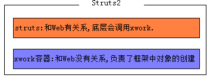
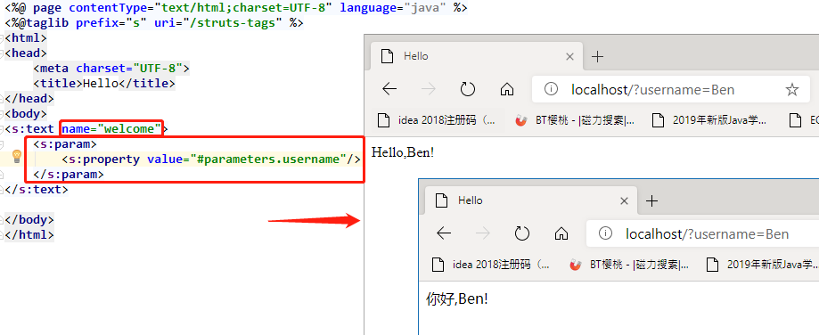

# Struts2 概述
1. 简介
基于MVC的轻量级的Web应用框架  
Apache Struts + OpenSymphony WebWork2 = Struts2 
  

2. 核心功能
* 允许POJO（Plain Old Java Objects）对象作为Action.
* Action的execute 方法不再与Servlet API耦合，更易测试
* 支持更多视图技术（JSP、FreeMarker、Velocity）
* 基于Spring AOP思想的拦截器机制，更易扩展
* 更强大、更易用输入校验功能
* 整合Ajax支持
* 等等

3. 目录结构  


<br/>

# Struts2 入门程序
1. 拷贝/apps/struts2-blank/WEB-INF/lib中的jar到项目的lib中.

2. 在web.xml配置Struts2的前端控制器 StrutsPrepareAndExecuteFilter.


> 配置的目的: 拦截请求, 由Sturts2的规则去处理请求, 而不是用Servelt去处理.  

3. 拷贝struts.xml文件到项目的SourceFolder(resources)中.

4. 定义一个POJO类:HelloAction,并提供一个公共无参数的sayHello方法.


5. 在struts.xml文件中,配置HelloAction (把HelloAction交给Struts2框架管理).


6. 访问Action.


<br/>

# Struts2简单执行流程
仅仅是从使用者的角度的流程


<br/>

# Struts2 配置
## struts.xml通过`<include>`元素指定多个配置文件:
```xml
<include file="xxx配置文件"/>
```
- - -
## 6大配置文件 (按照如下顺序加载struts2配置):   
1. `default.properties`  
    (该文件保存在 struts2-core-2.3.7.jar 中 org.apache.struts2包里面:包含了Struts2的默认常量配置)
2. `struts-default.xml`  
    (该文件保存在 struts2-core-2.3.7.jar:包含了框架依赖的对象配置和结果类型,拦截器等配置)
3. `struts-plugin.xml`  
    (该文件保存在Struts2框架的插件中:struts-Xxx-2.3.7.jar.由插件提供)

```
    1,2,3 是框架自带的,我们不能修改,只能阅读
```

4. `struts.xml`  
    (该文件是web应用默认的struts配置文件.重点.配置自定义的Action和其他信息)
5. `struts.properties`  
    (该文件是Struts的默认配置文件-->可以修改default.properties的常量配置, 在resources下创建 `struts.properties` 修改配置.)
6. `web.xml`  
    (该文件是Web应用的配置文件上述三个文件是我们可以修改操作的. 在配置Filter `StrutsPrepareAndExecuteFilter` 通过`<init-param>`修改.)

>* 如果多个文件配置了同一个struts2 常量，则后一个文件中配置的常量值会      覆盖前面文件配置的常量值.  
>* 注意:一般的,我们只在struts.xml中做常量配置.
- - -

## 常见的常量配置 (在 default.properties 找, 以下都是默认值)  
1. 指定默认编码集,作用于HttpServletRequest的setCharacterEncoding方法和freemarker,velocity的输出
```xml
<constant name="struts.i18n.encoding" value="UTF-8"/> 
```

2. 该属性指定需要Struts2处理的请求后缀，该属性的默认值是action，即所有匹配*.action的请求都由Struts2处理。如果用户需要指定多个请求后缀，则多个后缀之间以英文逗号（,）隔开
```xml
<constant name="struts.action.extension" value="action,,"/>
```
> struts2默认是处理`.action`的请求, 或者不带action也可以, 其它后缀都不会拦截, 会放行(如jsp).

3. 设置浏览器是否缓存静态内容,默认值为true(生产环境下使用),开发阶段最好关闭 
```xml
<constant name="struts.serve.static.browserCache" value="true"/>
```

4. 当struts的配置文件修改后,系统是否自动重新加载该文件(生产环境下使用),开发阶段最好打开 
```xml
<constant name="struts.configuration.xml.reload" value="false"/>
```

5. 开发模式下使用,这样可以打印出更详细的错误信息
```xml 
<constant name="struts.devMode" value="false" />
```

6. 默认的视图主题, value可选: xhtml,simple,ajax
```xml
<constant name="struts.ui.theme" value="xhtml" />
```

7. 是否支持动态方法调用
```xml
<constant name="struts.enable.DynamicMethodInvocation" value="false"/>
```

<br/>

# struts.xml 配置: package,action,result
## package
`<package>`元素: 是`<struts>`根元素的子元素.  
用来对多个`<action>`元素分类管理,和Java中的package没有关系.
```xml
<package name="" extends="" namespace="" abstract="">   </package>
```
常见的属性:
* ***name***  
表示`<package>`的名字,要保证不同的`<package>`元素的name不同. 可以通过该名字被其他的包所指代.
* ***extends***  
表示当前`<package>`继承哪一个`<package>`,一般都是struts-default. 而struts-default其实就是struts-default.xml中`<package>`元素的名字.
继承struts-default之后,就拥有了该`<package>`定义的所有资源.
* ***namespace***  
表示命名空间,一般的以"/"打头.,命名一般以模块名.如: /crm, /oa. 和`<action>`的name决定了一个Action类的访问路径.

> namespace的查找规则:  
访问 localhost/a/b/hello.action, 是访问不了  
访问 localhost/demo/a/b/hello.action, 是可以访问的


* ***abstract***  
若一个`<package>`的abstract="true",那么该`<package>`中就不能再定义`<action>`元素,只能用来继承.(如: struts-default)
> 抽象的,缺省值是: *false*    

	

## action
`<action>`元素:是`<package>`元素的子元素.  
专门用来配置Action类的,理论上一个Action类匹配一个`<action>`元素.
```xml
<action name="" class="" method=""/>    </action>
```
常见的属性:
* ***name***  
在同一个`<package>`中,action的名字必须唯一. 和`<package>`的namespace共同决定了一个Action类的访问路径. 注意:action的name值不能以"/"打头.
* ***class***  
一个Action类的全限定名.  
> 缺省值: *com.opensymphony.xwork2.ActionSupport* 类
* ***method***  
当前Action动作访问的方法.  
    * 方法要求: `public的; 没有参数`.  
> 缺省值: *execute*


## result
`<result>`元素:配置结果视图.  
```xml
<result name="" type="">    </result>
```
* **局部结果视图**: `<result>`定义在`<action>`中,只能是当前action跳转的结果视图.
* **全局结果视图**: `<result>`定义在`<global-results>`中,而`<global-results>`在`<package>`中,当前`<package>`中所有的action都可以跳转的结果视图. 
```xml
<package>
    <!-- <global-results> 必须写在 <action> 前面 -->
    <global-results>
        <result>视图1</result>
        <result>试图2</result>
    </global-results>
</package>
```

> 寻找规则:先找局部结果视图,找到就跳转,找不到再找全局结果视图,找到跳转,找不到报错.

常见的属性:
* ***name***  
Action方法返回的逻辑视图名称.  
> 缺省值: *success*
* ***type***  
结果的跳转类型.该类型的值在struts-default.xml中已经预定义好了.  


> 缺省值: *dispatcher*  
* 常见的type值(结果类型):
    * dispatcher:   表示从Action请求转发到页面(JSP).
    * redirect:     表示从Action重定向到页面(JSP).
    * chain:        表示从Action请求转发到另一个Action.
    * redirectAction: 表示从Action重定向到另一个Action.
    * stream:       表示返回流. 文件下载时使用.

> `<param name="">` name缺省值: *location* (地址)  

> 参数作用: 采用`依赖注入`思想. 类型视图其实都是靠类来实现的, 而param元素就是将配置的参数, 注入到类中, 调用对应类的属性的Setter方法注入类中的字段.  

```xml
<!-- 跳转到视图文件 -->
<result name="">
    <param name="location">视图文件地址</param>
</result>

<!-- 从config命令空间下的other 重定向到 /crm下的hello Action. -->
<action name="other">
    <result type="redirectAction">
        <param name="namespace">/crm</param>
        <param name="actionName">hello</param>
    </result>
</action>
```
<br/>

# 编写: Action类
1. 使用公共的POJO类作为Action.提供公共的无参数的Action方法.(不推荐)  
* 缺点:
    * 没有一种方式约束Action方法必须是公共的无参数的.  
    * Action方法的返回逻辑视图名可以自定指定. 有时起名不规范. 比如:"ooxx".

2. 定义一个类,实现 `com.opensymphony.xwork2.Action` 接口.并覆写`execute`方法即可.(不推荐)  
Action接口中,不仅提供了Action方法的声明,也提供了常用的逻辑视图名称:
    * public static final String SUCCESS = "success";  
    * public static final String NONE = "none";  
    * public static final String ERROR = "error";  
    * public static final String INPUT = "input";  
    * public static final String LOGIN = "login";    
* 缺点:
    不支持国际化,数据校验,消息机制.

3. 定义一个类,继承于 `com.opensymphony.xwork2.ActionSupport` 类.(推荐)  
```java
// ActionSupport 类
public class ActionSupport implements Action, Validateable, ValidationAware, TextProvider, LocaleProvider, Serializable {...}
```
```java
public class HelloAction extends ActionSupport{
    @Override
    public String execute() throws Exception {
        return SUCCESS;
    }
}
```
<br/>

# Action 多方法调用
`struts2-2.5版本需要在<action/>标签内, 添加允许访问的方法`
```xml
<action>
    <allowed-methods>方法名1,方法名2</allowed-methods>
</action>
```
## 动态方法调用 (官方不推荐)
浏览器访问格式：`action名!方法`  
`<action/>`元素不需要指定`method`属性值
```xml
<!-- 在Struts2新的版本中,默认的关闭了DMI, 设为true 打开 -->
<constant name="struts.enable.DynamicMethodInvocation" value="true"/>
```

## 使用通配符
```xml
<action name="*_*" class="struts2_demo.{1}Action" method="{2}">
    <allowed-methods>hello,bye</allowed-methods>
</action>
```
* 浏览器访问地址:  
    * localhost/`namespace`/Hello_hello  
    访问 struts2_demo.HelloAction 的 hello 方法  
    * localhost/`namespace`/Hello_bye  
    访问 struts2_demo.HelloAction 的 bye 方法

<br/>

# Action访问Servlet API
## 1.通过让Action类去实现感知接口.
* `ServletRequestAware` ：感知HttpServletRequest对象  
* `ServletResponseAware`：感知HttpServletResponse对象  
* `SessionAware` ：感知HttpSession对象 
```java
public class ServletApiAction extends ActionSupport implements ServletRequestAware,ServletResponseAware,SessionAware{
    private HttpServletRequest request;
    private HttpServletResponse response;
    private Map<String, Object> session;

    @Override
    public void setServletRequest(HttpServletRequest reequest) {
        this.request = reequest;
    }

    @Override
    public void setServletResponse(HttpServletResponse response) {
        this.response = response;
    }

    @Override
    public void setSession(Map<String, Object> map) {
        this.session = map;
    }

    /*
        这里的setXxx方法是拦截器调用，将servlet的api传进来，
        我们就可以在访问的方法直接像Servlet使用这些api对象。
    */
}
```
> 此时项目需要依赖 **servlet-api.jar**  
> 问题: 和ServletAPI藕合严重. 一般的,我们不用,留给框架自己使用的

## 2.使用 ServletActionContext 类  
该类提供很多静态方法可以返回Servelet API对象. (使用的非常频繁,因为简单易用).
* static HttpServletRequest `getRequest`() : 返回 HttpServletRequest 对象
* static HttpServletResponse `getResponse`() : 返回 HttpServletResponse 对象
* static ServletContext `getServletContext`() : 返回 ServletContext 对象.
```java
// 获取 servlet api对象
ServletActionContext.getXxx() 
```

## 3.使用 ActionContext 类  
本身是Struts2对Servlet API的封装.(建议和优先选用)  
* `ActionContext` : Action的环境对象,每一次请求都是一个新的Action对象,一个ActionContext对象封装了这一次请求的相关数据.  
* `ActionContext` 使用了ThreadLocal模式,所以说是线程安全的.  

* ActionContext的常用方法: 此时把作用域对象全部使用 **Map** 来表示.
```java
// 创建ActionContext对象
ActionContext context = ActionContext.getContext();

// 获取请求参数
context.getParameters();

// request作用域对象 (ActionContext本身就是对一次请求的封装)
context.put("requestName","requestValue");  // 设置共享数据
context.get("requestName");                 // 获取共享数据

// session作用域对象
context.getSession().put("sessionName","sessionValue"); // 设置共享数据
context.getSession().get("sessionName");                // 获取共享数据

// application作用域对象
context.getApplication().put("appName","appValue"); // 设置共享数据
context.getApplication().get("appName");            // 获取共享数据
```
<br/>

# Action 获取请求参数
## 1.Action本身作为Model对象,通过setter方法封装(属性注入)
```html
<form action="/demo/user_show" method="post">
    Username : <input type="text" name="username"/> <br/>
    Age : <input type="text" name="age"/> <br/>
    <input type="submit">
</form>
```
```java
public class UserAction extends ActionSupport{

    private String username;
    private int age;

    // 属性:username 与表单input的name的值 一致
    public void setUsername(String username) {
        this.username = username;
    }

    // 属性:age 与表单input的name的值 一致, 且自动转换类型
    public void setAge(int age) {
        this.age = age;
    }

    public String show() throws Exception {
        System.out.println("username = " + username);
        System.out.println("age = " + age);
        return NONE;
    }
}
```


## 2.创建独立Model对象,页面通过ognl表达式封装(属性注入)
```html
<form action="/demo/user_show" method="post">
    Username : <input type="text" name="u.username"/> <br/>
    Age : <input type="text" name="u.age"/> <br/>
    <input type="submit">
</form>
```
```java
@Setter
@ToString
public class User {
    private String username;
    private Integer age;
}
```
```java
public class UserAction extends ActionSupport{
    @Getter
    private User u = new User();

    public String show() throws Exception {
        System.out.println( u );
        return NONE;
    }
}
```
> * Model对象`u`必须提供`Getter`方法, 因为拦截器会调用getU()方法设置u的属性值. 若不提供Getter方法, 对象u每次设置值都是新的User对象, 导致获取数据不完整.
> * `u`要么new出来, 要么提供`Setter`方法, 因为拦截器调用getU()检测对象u是否为null. 若为null则创建对象通过setU()方法设置进去.


List封装参数对象


## 3.使用ModelDriven接口,对请求数据进行封装(模型驱动)
```html
<form action="/demo/user_show" method="post">
    Username : <input type="text" name="username"/> <br/>
    Age : <input type="text" name="age"/> <br/>
    <input type="submit">
</form>
```
```java
@Setter
@ToString
public class User {
    private String username;
    private Integer age;
}
```
```java
public class UserAction extends ActionSupport implements ModelDriven<User>{

    private User u = new User();

    @Override
    public User getModel() {
        return u;
    }

    public String show() throws Exception {
        System.out.println( u );
        return NONE;
    }
}
```


## 4.静态参数注入 (少用)
```xml
<action name="other" class="demo.UserAction" method="show">
    <param name="username">Hao</param>
    <param name="age">18</Hao>
</action>
```
- - -
> 参数注入的原理: 有两个拦截器在工作, `params`和`modelDriven`.

> 三种方式的选择问题:
>   * 如果参数较少,且没有建立Model对象,使用方式1.
>   * 更多选用方式2.
>   * 也会出现 方式1+方式2 或者 方式1+方式3 ,例子:修改密码.
- - -

<br/>

# struts2流程图

- - -
1. 客户端发送请求.  
2. 该请求经过一系列的过滤器(Filter)：其中可选过滤器ActionContextCleanUp, 帮助Struts2和其他框架集成. (例如: SiteMesh Plugin)  
3. 接着FilterDispatcher被调用, FilterDispatcher询问ActionMapper, 来决定该请求是否需要调用某个Action.   
4. 若ActionMapper决定需要调用某个Action, FilterDispatcher把请求的处理交给ActionProxy.  
5. ActionProxy通过Configuration Manager询问框架的配置文件，找到需要调用的Action类.  
6. ActionProxy创建一个ActionInvocation的实例.  
7. ActionInvocation实例调用Action的前后, 涉及到相关拦截器(Intercepter)的调用.  
8. 一旦Action执行完毕, ActionInvocation负责根据 struts.xml 中的配置找到对应的返回结果. 返回结果是一个JSP或其他页面(也可以是其他的Action链). JSP页面展现可使用Struts2框架中的标签(该过程会涉及ActionMapper).  

> 在上述过程中所有的对象(Action、Interceptors、Results等)都由xwork容器中的ObjectFactory创建.  
- - -

<br/>

# 拦截器: Interceptor
## 1.简介
* 拦截器是在访问某个Action或Action的某个方法之前或之后实施拦截，并且Struts2拦截器是可插拔的，拦截器是 AOP(面向切面编程.其实现原理:动态代理模式) 的一种实现．  

* 拦截器是动态拦截Action调用的对象。它提供了一种机制可以使开发者可以定义在一个Action执行的前后执行的代码，也可以在一个action执行前阻止其执行。同时也提供了一种可以提取Action中可重用的代码的方式。

* `拦截器栈`(Interceptor Stack): 将拦截器按一定的顺序连接成一条链。在访问被拦截的方法或字段时，Struts2拦截器链中的拦截器就会按其之前定义的顺序被调用.  

* 拦截器是`单例`的.  

 

* 优点:   
    1.简化Action的实现  
    2.功能更单一  
    3.通用代码模块化  
    4.提高重用性 
- - -
## 2.内置拦截器
`内置拦截器`: 在Struts2框架中预先定义好的,并且配置好的拦截器 (struts-default.xml).  


1. `params 拦截器`  
    偷偷的把请求参数设置到相应的Action的属性去的，并自动进行类型转换.

2. `modelDriven 拦截器`  
    如果Action实现ModelDriven接口，它将getModel()取得的模型对象存入OgnlValueStack中.

3. `exception 拦截器`  
    顾名思义，在抛出异常的时候，这个拦截器起作用。最好把它放在第一位，让它能捕获所有的异常.

4. `validation 拦截器`  
    调用验证框架读取 *-validation.xml文件，并且应用在这些文件中声明的校验.

5. `token 拦截器`  
    核对当前Action请求（request）的有效标识，防止重复提交Action请求.

6. `fileUpload 拦截器`   
    用来处理文件上传.

7. `workflow 拦截器`  
	调用Action的validate方法，一旦有错误返回，重新定位到INPUT结果视图.

8. `servletConfig 拦截器`  
    通过感知接口,获取感应对象.

9. `store 拦截器`  
    保证在两次请求之间共享数据的.
- - -
## 3.自定义拦截器
### 步骤:   
1. 定义拦截器类
* 方式1: 实现 `com.opensymphony.xwork2.interceptor.Interceptor` 接口.  
* 方式2: 继承 `com.opensymphony.xwork2.interceptor.AbstractInterceptor` 类.  
* 方式3: 继承 `com.opensymphony.xwork2.interceptor.MethodFilterInterceptor` 类. 

2. 在struts.xml中配置拦截器  
* 先在 `<package>` 中声明拦截器
* 在 `<action>` 中来引用拦截器

### 例: 登陆检查拦截器( CheckLoginInterceptor )
访问 `localhost/demo/User_show`检测session有无User对象, 没有就跳转到登陆页面.  

  
  

问题:
1. 登陆失败,永远进不了UserAction, 不能进入login方法.
* 原因: 进入login之前,需要判断session中是否有USER_IN_SESSION.
而USER_IN_SESSION只有在login中才能设置.
* 结论: UserAction中login方法(User_login)不需要做登陆检查.  
- - -
2. 在UserAction中再也获取不了请求参数.  
* 原因: 当我们在`<action>`设置了拦截器引用,那么`<package>`之前的默认的拦截器栈(defaultStack)就不引用了,那么defaultStack中的获取请求参数的拦截器也不再引用.  
* 解决: 再添加默认的拦截器栈(defaultStack)
```xml
<action>
    <interceptor-ref name="checkLogin"/>
    <interceptor-ref name="defaultStack"/>
<action>
```
- - -
3. 如果有多个`<action>`元素都需要这个拦截器,那么每一个`<action>`元素中都得去引用该拦截器,很烦.  
* 解决: 在`<package>`中设置全局的拦截器引用,针对于该`<package>`中所有的`<action>`元素都有效.
```xml
<package>
    <interceptors>
        <!-- 定义拦截器 -->
        <interceptor name="checkLogin" class="demo.CheckLoginInterceptor"/>
        <!-- 定义拦截器栈 -->
        <interceptor-stack name="myStack">
            <interceptor-ref name="checkLogin"/>
            <interceptor-ref name="defaultStack"/>
        </interceptor-stack>
    </interceptors>
    <!-- 配置package默认拦截器栈 -->
    <default-interceptor-ref name="myStack"/>
</package>
```
- - -
## 4.拦截器设置参数
```xml
<interceptor name="checkLogin" class="demo.LoginInterceptor">
    <param name="excludeMethods">login</param>
</interceptor>
```
1. 继承 `AbstractInterceptor`
```java
public class LoginInterceptor extends AbstractInterceptor{
    // 不需要拦截的方法
    private Set<String> excludeMethods = new HashSet<>();
    // 服务器初始化, struts.xml配置的参数会根据属性名调用Setter方法设置进来
    public void setExcludeMethods(String methods){
        String[] splits = methods.split(",");
        for (String method : splits) {
            this.excludeMethods.add(method.trim());
        }
    }

    @Override
    public String intercept(ActionInvocation actionInvocation) throws Exception {
        // 获取action名, 如User_login
        String actionName = actionInvocation.getProxy().getActionName();
        // 获取访问的方法名
        String methodName = actionName.substring(actionName.indexOf("_")+1);
        // 获取ActionContext实例, 再获取session, 再查询User对象
        Object user = actionInvocation.getInvocationContext().getSession().get("USER_IN_SESSION");

        if( !excludeMethods.contains(methodName) && user == null ){
            return "login"; // 跳转到登陆页面
        }

        return actionInvocation.invoke();   // 放行到下一个拦截器
    }
}
```
- - -
2. 继承 `MethodFilterInterceptor`
* MethodFilterInterceptor 是 AbstractInterceptor 的子类, 后者会拦截整个action, 前者针对action的方法进行拦截.  
* MethodFilterInterceptor 提供两个属性 `excludeMethods`(不需要拦截的方法) 和 `includeMethods`(需要拦截的方法).  
    * 两者都不设置: 拦截所有方法.
    * 设置excludeMethods: 不拦截所设的方法, 其他都拦截.
    * 设置includeMethods: 只拦截所设的方法, 其他都不拦截.
    * 两者都设置: 与设置includeMethods一致.
```java
public class LoginInterceptor extends MethodFilterInterceptor{
    @Override
    protected String doIntercept(ActionInvocation actionInvocation) throws Exception {
        // 获取ActionContext实例, 再获取session, 再查询User对象
        Object user = actionInvocation.getInvocationContext().getSession().get("USER_IN_SESSION");

        if(  user == null ){
            return "login"; // 跳转到登陆页面
        }

        return actionInvocation.invoke();   // 放行到下一个拦截器
    }
}
```
- - -
## PrepareInterceptor 拦截器
prepare拦截器: 用于预处理数据, 再执行目标方法.  
- - -
1. 使用步骤
* 实现 `com.opensymphony.xwork2.Preparable` 的 `prepare` 方法, 在prepare方法里编写预处理代码.  
(这样做, 执行Action的所有方法都会先执行prepare方法). 

* 只对特定方法之前, 执行预处理操作.
    * prepare方法代码为空
    * 针对特定方法xxx, 编写方法`prepareXxx`或`prepareDoXxx`, 预处理操作写在里面.

> 无论如何`prepare`方法都会执行, 但是存在 `prepareXxx`或`prepareDoXxx`方法,执行顺序为: prepareXxx -> prepare -> 目标方法.
- - -
2. 拦截器栈: `paramsPrepareParamsStack`

  
因为`defaultStack`拦截器栈 prepare拦截器 在 params拦截器 之前, 所以预处理操作不能 获取到传给action的参数等params拦截器做的操作.  

`paramsPrepareParamsStack`拦截器栈 就可以解决这个问题.
  

<br/>

# OGNL
在Strtus2中:引出OGNL和ValueStack. 把数据共享在某一个作用域对象中.  
* Action:
```java
ActionContext.getContext().put(String name,Object value);
ActionContext.getContext().getSession().put(String name,Object value);
```
* JSP:
  此时得依赖Struts2的标签:
```html
<%@ taglib uri="/struts-tags" prefix="s" %>
```
  再通过 `<s:property value="OGNL的语法">` 标签来获取数据.  

## OGNL
### 简介
* OGNL是Object Graphic Navigation Language (对象图导航语言[负责:对象和页面之间数据传输]) 的缩写, 它是一个开源项目.  
* Struts2框架使用OGNL作为默认的表达式语言.  
*   EL(表达式语言),OGNL就是EL的升级版.  
    作用: Action和视图(JSP)之间数据交互的桥梁.  
    (讲解OGNL之前,先得学习ValueStack)
- - -
### OGNL功能  
* 访问对象方法: `对象.方法()`  
```html
<s:property value="'HELLO'.length()"/>
```
- - -
* 访问静态属性: `@全限定类名@静态属性`  
```html
<s:property value="@java.lang.Integer@MAX_VALUE"/>
```
- - -
* 访问静态方法: `@全限定类名@静态方法()`  
```xml
<!-- 必须开启, 才允许使用OGNL访问静态方法 -->
<constant name="struts.ognl.allowStaticMethodAccess" value="true"/>
```
```html
<s:property value="@java.lang.Math@random()"/>
```
- - -
* 封装List数据(不限类型)
```html
<s:property value="{'A', 18, 3.14}"/>
```
- - -
* 封装Map数据(不限类型)
```html
<s:property value="#{'a':1, 'b':2}"/>
```
- - -
* 投影  
    * 指定属性: `集合.{属性名}`  
    * 条件过滤:  
        * `集合.{?#条件}` (所有符合条件)  
        * `集合.{^#条件}` (第一个符合条件)  
        * `集合.{$#条件}` (最后一个符合条件)  
- - -
* `#`  
    * `#key` : 取contextMap的value  
    * `#{key:value}` : OGNL创建Map对象  
- - -
* `$`
    * `${name}` : EL表达式取值  
    * `${OGNL表达式}` : xml配置文件中, 编写OGNL表达式  
- - -
* `%`
    * `%{OGNL表达式}` : 把OGNL表达式看作是一个字符串


<br/>

# ValueStack(值栈)
## ValueStack
1.  `ValueStack` 是对应每一个**请求对象**的轻量级的内存数据中心.  
    每一次请求的时候, 都会创建一个新的ValueStack对象, 该ValueStack对象封装了这一次请求相关的数据信息.  

> * 每一次动作访问, 核心控制器`StrutsPrepareAndExecuteFilter`都会创建一个`ActionContext`和`ValueStack`对象.  
> * 这两个对象存储了整个动作访问期间用到的数据, 并且把数据绑定到了线程局部变量(ThreadLocal)上, 所以线程是安全的.   

2. `ValueStack` 实际是一个接口, 在Struts2中利用OGNL时，实际上使用的是实现了该接口的 `OgnlValueStack` 类, 这个类是Struts2利用OGNL的基础.  

3. `ValueStack` 贯穿整个Action的生命周期(一次请求): 每个Action类的实例都拥有一个ValueStack对象. ValueStack相当于数据的中转站，在其中保存该次请求和当前Action对象和其他相关对象信息.  
    
    >一次请求 ---> 一个新的Action对象 ----> 一个新的ValueStack对象.  
4. Struts2框架把ValueStack对象保存在名为 `struts.valueStack` 的 `request属性` 中.  
    ```java
    // 底层操作, 当存在一次新的请求
    ValueStack vs =   new ... ;
    request.setAttribute("struts.valueStack",vs);
    ```
- - -

## 获取ValueStack
1. 通过 `HttpServletRequest` 对象获取, 属性名为: `struts.valueStack` .
```java
ValueStack vs = (ValueStack) request.getAttribute("struts.valueStack");

ValueStack vs = (ValueStack) ServletActionContext.getRequest().getAttribute("struts.valueStack");

ValueStack vs = (ValueStack) ServletActionContext.getRequest().getAttribute(ServletActionContext.STRUTS_VALUESTACK_KEY);
```

2. 通过 `ActionContext` 对象获取
```java
ValueStack vs = ActionContext.getContext().getValueStack();
```
> 以上两种方式获取的是同一个ValueStack对象.
- - -

## ValueStack的内部结构


ValueStack对象中有两个很重要的属性,这两个属性就是ValueStack的主要内部结构.

名称 | 类型 | 含义 | 作用
:-:|:-:|:-:|:-
root | CompoundRoot extends ArrayList | 表示了栈的数据结构 | 主要存储Action对象相关的数据信息
context | Map | 上下文 | 主要存储映射关系数据(key-value)

* context存在用root对象的引用 (只要拿到context对象就可以获取到root对象).  
* context中还存在request,session,application,attr,parameters对象的引用.  
* 获取到context,就可以获取ValueStack中所有的数据.   

### 通过 `<s:debug/>` 查看ValueStack
1. 先引入Struts2的标签
```html
<%@ taglib uri="/struts-tags" prefix="s"%>
```
2. 通过Struts2的调试标签 `<s:debug/>` 标签  
主要用来观察数据在哪一个空间 (root,context)  

 
- - -

## ValueStack的数据操作
### root
#### 数据放入root (栈,ArrayList.每次都要压在栈顶)

```java
ValueStack valueStack = ActionContext.getContext().getValueStack();

// 方式1: 根据索引位置, 插入数据 (一般压入栈顶, index写0)
valueStack.getRoot().add(int index, Object element);

// 方式2: 把数据压入栈顶, 等价于 root.add(0, Obejct val);
valueStack.getRoot().push(Object o);

/*
    方式3: 新建一个HashMap压入栈顶, 然后将 [key-value] put入栈顶的map. 
    注意: 如果栈顶不是原来那个map, 重新新建一个HashMap, 压入栈顶, 再将数据put入这个map, 因为永远都是放入root栈顶的map.
    注意: 是valueStack的set方法, 不是root的set方法.
*/
valueStack.set(String key, Object val); 

/*
    方式4: 在Action中提供一个可访问的属性(getter方法).
    目的: 保证Action在栈顶,如果Action在栈顶,我们可以轻松获取栈顶对象中的数据.
*/
public String getUser(){
    return this.user;
}
```
> 一般的,如果是多条数据(集合),我们不建议存储在root区域,建议存储在context区域.

#### 获取root中数据
```html
<%@ taglib uri="/struts-tags" prefix="s"%>

<s:property value="OGNL表达式"/>

<!--放入root中的数据, 没有属性名, 不推荐-->
<s:property value="[0].top"/>

<!--放入root中的数据有属性名 (直接获取栈顶对象中的属性值)-->
<s:property value="属性名"/>
```
- - -
### context
#### 数据放入context
```java
// 方式1: (缺点: 太长了)
ValueStack valueStack = ActionContext.getContext().getValueStack();
valueStack.getContext().put(String key, Object value);

// 方式2
ActionContext.getContext().put(String key, Object value);
```
>  一般的:把集合中的数据放入context中.
```html
<s:property value="#作用域.key"/>
```
作用域:
* 直接使用 `#key`, 作用域是: ValueStack的context区域.
* parameters
* action
* request
* session
* application
* attr(按顺序检索: request > session > application)

> EL可以访问ValueStack中的数据, 但是不建议这么做.  
> * 原因: Struts2重新包装而来请求对象.  
> * 不建议在struts2使用 EL表达式.  

<br/>

# Struts2 标签
## 标签库
引用标签库:
```html
<%@ taglib uri="/struts-tags"  prefix="s"%>
```
> Struts的标签中不能嵌套,否则报错 (就是: 标签中,不能再使用标签).

Control Tags | Data Tags | Form Tags | Non-Form UI Tags
:-|:-|-|-
if | a | checkbox | actionerror 
elseif | action | checkboxlist | actionmessage
else | bean | combobox | component
append | date | datetextfield | fielderror
generator | debug | doubleselect
iterator | i18n | head
merge | include | file
sort | param | form
subset | property | hidden
| | push | inputtransferselect
| | set | label
| | text | optiontransferselect
| | url | optgroup
| | | password
| | | radio
| | | reset
| | | select
| | | submit
| | | textarea
| | | textfield
| | | token
| | | updownselect
- - -
## 常用标签
* 选择判断
```html
<s:if test="#num > 5">
    Num > 5
</s:if>
<s:elseif test="#num < 5">
    Num < 5
</s:elseif>
<s:else>
    Num == 5
</s:else>
```
* 迭代
```html
<s:iterator begin="1" end="10" var="num">
    <s:property value="num"/>
</s:iterator>

<s:iterator value="#request.listDat" var="item">
    <s:property value="item"/>
</s:iterator>

<!-- 取出 root 区域的集合数据迭代
不使用var, 每次迭代的变量: User对象 保存在Action中(Action又在root中)
所以取迭代对象的属性值, 用: 属性名 -->
<s:iterator value="users">
    <s:property value="username"/>
</s:iterator>

<!-- 取出 root 区域的集合数据迭代
使用var, 每次迭代的变量: User对象,别名u 保存在context区域.
context.put("u", User对象).
所以取迭代对象的属性值, 用: #u.属性名
 -->
<s:iterator value="users" var="u">
    <s:property value="#u.username"/>
</s:iterator>

<!-- 取出 context 区域的集合数据迭代 (不使用var) -->
<s:iterator value="#users">
    <s:property value="username"/>
</s:iterator>

<!-- 取出 context 区域的集合数据迭代 (使用var)
使用var, 每次迭代的变量: User对象,别名u 保存在context区域.
context.put("u", User对象).
所以取迭代对象的属性值, 用: #u.属性名
 -->
<s:iterator value="#users" var="u">
    <s:property value="#u.username"/>
</s:iterator>
```
* 数据控制
```html
<!-- 
    default : #info为空, 返回的默认值.
    escapeHtml : 是否忽略default的html语法, 默认true为忽略.
 -->
<s:property value="#info" default="<b>默认值</b>" escapeHtml="false" />

<!-- 
    得到的url为: localhost/demo/hello.action?username=Hao
    因为 value="Hao" 解析为去root区域拿key为Hao的值,
    %{"Hao"} 解析为 字符串 Hao .
 -->
<s:a namespace="/demo" action="hello">
    <s:param name="username" value='%{"Hao"}'/>
    这是链接
</s:a>

<!-- 创建链接, 别名myUrl, 被 <a>或<s:a> 引用 -->
<s:url namespace="/demo" action="hello" var="myUrl">
    <s:param name="username" value='%{"Hao"}'/>
</s:url>
<!-- 引用myUrl -->
<a href='<s:property value="myUrl"/>'>myUrl</a>
<s:a href='%{myUrl}'>myUrl</s:a>
```
* 表单
```html
<s:form namespace="/demo" action="User_login" method="post" enctype="multipart/form-data" theme="simple">
    账号:<s:textfield name="username"/>
    <br/>
    密码:<s:password name="password"/>
    <br/>
    性别:<s:radio name="gender" list="{'男','女'}" value="%{'男'}"/>
    <br/>
    性别:<s:radio name="sex" list="#{'1':'男','2':'女'}" value="%{'2'}"/>
    <br/>
    <s:checkbox name="hobbies" value="python">Python</s:checkbox>
    <br/>
    <s:checkboxlist name="hobbies" list="#{'java':'Java', 'c':'C'}"/>
    <br/>
    头像:<s:file name="headImg"/>
    <br/><br/>
    介绍:<s:textarea name="intro" rows="3" cols="20"/>
    <br/>
    省:<s:select list="#{'gd':'广东', 'gz':'广西'}" headerKey="-1" headerValue="--请选择--" />
    <br/>
    <s:submit value="提交"/>
    <s:reset value="重置"/>
</s:form>
```


<br/>

# Struts2 国际化
## 范围 (优先级:就近原则)
* 全局
    * resources目录/基本_语言_国家.properties
* 包范围
    * src的包/package_语言_国家.properties  
     (package是固定的,资源包能被该包及其子包中的动作类访问)
* 局部
    * action包/Action类名_语言_国家.properties  
    (资源包只为动作类服务)


- - -
## 全局资源 步骤
1. struts.xml 指定国际化的properties的资源, 指定value为资源开头名.
```xml
<constant name="struts.custom.i18n.resources" value="app"/>
```
- - -
2. 资源: 基本_语言_国家.properties (基本就是value的值)  

app_zh_CN.properties
```properties
username=账号
password=密码
login=登录
```
app_en_US.properties
```properties
username=Username
password=Password
login=Login
```
- - -
3. jsp


- - -
4. 结果


- - -
5. 注意
遇到中文乱码, 注意看编译后的国际化资源文件，看本身有没有乱码.


properties中文转码结果  

- - -
6. 国际化资源文件 使用占位符




<br/>

# Struts2 校验
## 输入校验 概述
对用户输入的数据,做正确的判断,判断用户输入的数据是否合法,一般会使用正则表达式.  
* 客户端校验: 过滤正常用户的误操作，通过JS代码完成(可以绕开).
* 服务端校验: 整个应用阻止非法数据的最后防线(必须),使用Java代码.
* 数据库校验: 在保存数据进数据库的时候,对数据的合法性做校验.

## 输入校验 方式
1. 代码校验: 开发中常用.
2. 配置校验:
    * 基于XML配置校验(推荐使用).
    * 基于Annotation配置校验.  

## Validate 步骤
Action中
1. 要继承ActionSupport
2. 重写Validateable接口中的validate()方法 ,在该方法中完成验证.  
    * validate()方法在其他的业务方法之前执行
    * 验证出错转向的页面 (其中input转向是在action中已经定义好的).
    ```xml
    <!-- struts.xml -->
    <result name="input">/login.jsp</result>
    ```
    * 什么时候表示验证出错(转向input所指向的页面)
        ```java
        super.addActionError("错误信息");
        // actionMessages 集合不空,不是错误信息,不会跳到错误页面
        // super.addActionMessage("信息");
        super.addFieldError("字段名称", "错误信息");
        ```
        * 当error集合不为空时,转向错误页面.
        * 若校验失败,不会再执行Action中的业务方法.

  
```java
public class LoginAction extends ActionSupport{
    @Getter
    public User u = new User();

    public String login() throws Exception {
        System.out.println(u);
        return NONE;
    }

    public void validate() {
        if( u.getUsername() == null || u.getUsername().length() > 10 ){
            addFieldError("username","账号长度超长");
        }
    }
}
```
```html
<s:form namespace="/demo" action="login" method="post">
    账号:<s:textfield name="u.username"/>
    <br/>
    密码:<s:password name="u.password"/>
    <br/>
    <s:submit value="提交"/>
    <!-- 根据key获取错误信息 -->
    <s:property value="fieldErrors.username"/>
</s:form>
```

## 校验细节
1. 为什么校验失败,默认跳转到 "input" 结果视图?
* validation: 判断该方法执行之前是否需要校验,如果需要校验,把校验的错误信息存储起来(Map<String, List<String>> fieldErrors).

* workflow: 判断如果fieldErrors集合有错误信息,决定了应该跳转到哪一个结果视图.


- - -
2. 校验失败会跳到默认的结果视图 "input", 是否可以修改默认的结果视图?
* `@InputConfig(resultName = "error")`
    * 改变结果视图, 直接跳转到 "error" 这个视图.
* `@InputConfig(methodName = "errorMethod")`
    * 不会跳到"input", 而是去执行errorMethod这个方法.

> 贴到方法上, 被贴方法按照标签执行具体跳转.

- - -
3. 为什么执行input方法之前,没有执行validate方法?  

* 在defaultStack拦截器栈中观察得知,validation和workflow拦截器会排除 input,back,cancel,browse 方法, 也就是请求这4个方法,不会做检验操作.
- - -
4. Action中某些方法不需要校验,却也执行了validate方法,如何避免?  
* 使用 `@SkipValidation` 贴在方法上, 被贴方法直接放行.
- - -
5. 一个Action中,校验的方法是少数,大多数方法都不需要校验,大多数方法都要使用 @SkipValidation , 烦?
* 首先不要重写`validate`方法, 针对需要校验的方法`xxx`, 构建一个`validateXxx`方法.
```java
public String login() throws Exception {
    System.out.println(u);
    return NONE;
}

public void validateLogin(){
    if( u.getUsername().length() > 10 ){
        addFieldError("username", "账号长度超长");
    }
}
```
> Action类中访问任何方法, 都会执行 `validate`方法.  
如果存在 `validateXxx`方法, 执行顺序:  
`validateXxx -> validate -> xxx` .
<br/>

# 文件上传
## 例子
### 单文件上传
```html
<s:form namespace="/demo" action="upload" method="post" enctype="multipart/form-data">
    <s:textfield name="username"/>
    <s:file name="headImg"/>
    <s:submit/>
</s:form>
```
```java
public class UploadAction extends ActionSupport{
    @Setter
    private String username;

    @Setter
    private File headImg;   // 上传的文件

    @Setter
    private String headImgFileName; // 上传文件的名字

    @Setter
    private String headImgContentType;  // 上传文件的MIME类型

    public String upload() throws Exception {
        // 获取保存文件的真实目录
        String path = ServletActionContext.getServletContext().getRealPath("/upload");
        // 构建上传文件
        File destFile = new File(path, headImgFileName);
        // 文件内容拷贝
        FileUtils.copyFile(headImg, destFile);
        return NONE;
    }
}
```
- - -
### 多文件上传
```html
<s:form namespace="/demo" action="upload" method="post" enctype="multipart/form-data">
    <s:file name="headImg"/>
    <s:file name="headImg"/>
    <s:file name="headImg"/>
    <s:submit/>
</s:form>
```
```java
// 既可以用数，也可以用List<> , 必须提供Setter方法
@Setter
private File[] headImg;   // 上传的文件

@Setter
private String[] headImgFileName;// 上传文件的名字

@Setter
private String[] headImgContentType; // 上传文件的MIME类型
```

>   headImg : 对应`<s:file>`的name属性值  
    headImgFileName : `xxxFileName` 对应文件名  
    headImgContentType : `xxxContentType` 对应文件MIME类型
- - -
## 细节


* Struts2中处理文件上传的功能存储在
`<interceptor name="fileUpload" class="org.apache.struts2.interceptor.FileUploadInterceptor"/>`.

* 在 `FileUploadInterceptor`拦截器 中存在两个属性(setter):  
(类型不匹配,超过大小,都会进入input视图)
    * `maximumSize` : 设置单个上传文件的最大字节.
    * `allowedExtensions` : 设置允许上传的问题拓展名. 
```xml
<interceptors>
    <interceptor-stack name="myStack">

        <interceptor-ref name="fileUpload">
            <!-- 设置单个上传文件的最大字节 -->
            <param name="maximumSize">1048576</param>
            <!-- 设置允许上传的问题拓展名 -->
            <param name="allowedExtensions">png,jpg</param>
        </interceptor-ref>
        <interceptor-ref name="defaultStack"/>

    </interceptor-stack>
</interceptors>

<default-interceptor-ref name="myStack"/>
```
* 上传错误信息 国际化  
提示信息都在 `struts-messages.properties`(org.apache.struts2包) 文件里预定义.
```xml
<!-- struts.xml -->
<constant name="struts.custom.i18n.resources" value="app"/>
```
将 key=value 拷贝到资源文件, 再翻译value

结果


<br/>

# 文件下载
struts2提供了 `<result type="stream">` 结果类型，该结果类型就是专门用于支持文件下载功能的.  
* 指定stream结果类型: 需要指定一个 `inputName` 参数，该参数指定一个输入流，提供被下载文件的入口.


* 步骤
```xml
<action name="download" class="demo.DownloadAction">
    <result type="stream">
        <!-- 设置:返回下载输入流方法的 名称 -->
        <param name="inputName">targetFile</param>
        <!-- 设置:下载文件的建议保存名称,获取Action类中传递的fileName属性 -->
        <param name="contentDisposition">
            attachment;fileName="${fileName}"
        </param>
        <!-- 
            ${fileName}:调用Action的getFileName()方法
        -->
    </result>
</action>
```
```java
// 执行execute方法, 返回"success"
public class DownloadAction extends ActionSupport{
    // 文件名, url传过来 localhost/demo/download?fileName=xxx
    private String fileName;

    public String getFileName() {
        return fileName;
    }

    public void setFileName(String fileName) throws Exception{
        this.fileName = new String(fileName.getBytes("ISO-8859-1"), "UTF-8");
    }

    // 根据配置文件设置的inputName的值:targetFile, 提供文件的输入流
    public InputStream getTargetFile() throws Exception {
        File file = new File("e:/",fileName);
        return new FileInputStream(file);
    }

}
```
> 访问: localhost/demo/download?fileName=xxx  
    下载xxx文件
